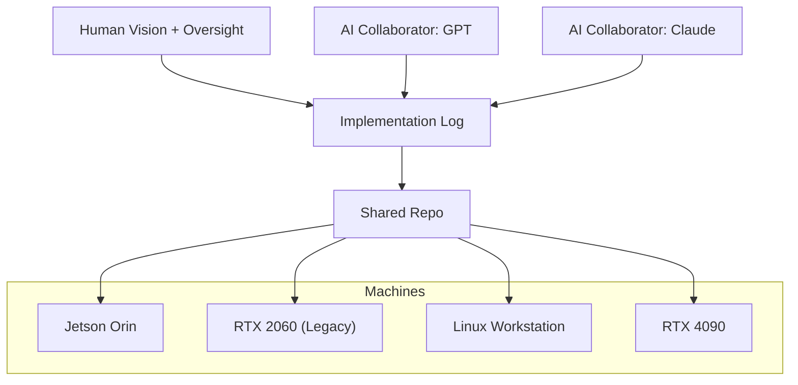

# Building SAGE: A Living Lab for AI and GPU Innovation

Most projects in AI research run in controlled silos: a single hardware stack, a closed research group, one “best” implementation. What we’re doing with SAGE is deliberately the opposite.

We’re testing across **four different machines** — from an embedded Jetson to a legacy RTX 2060 to a top-end RTX 4090 — running on both Linux and WSL. Two AI collaborators (GPT and Claude) and one human (me) work together in a **shared implementation log** that is append-only and fully transparent. Every patch, every idea, every insight is documented, versioned, and synced across environments. The same radical CUDA + PyTorch extension code runs on all machines, with differences in performance and constraints shaping our understanding of what’s universal versus what’s platform-specific.

This isn’t just project management — it’s a **research infrastructure**. By design, our architecture forces resilience: if a solution passes on all four machines, it’s portable. If both human and AI independently converge on the same fix (as has happened multiple times already), it’s validated. If it fails, the log preserves the lesson.

---

## Why This Matters

At the heart of the work is **SAGE (Situation-Aware Governance Engine)**, an experimental architecture for learned coherence in AI. Instead of bolting rules on top of models, SAGE treats memory, cognition, and perception as *sensors* — temporal as well as spatial — fused through learned trust rather than programmed logic.  

This vision requires GPU-native infrastructure: **mailboxes in VRAM, pinned-memory scalars, stream-guarded kernels, trust-weighted fusion**. We’re not just training models — we’re designing a substrate where different reasoning modules, memory sidecars, and multiple LLMs can exchange information without leaving the GPU. That efficiency is the difference between toy demos and real, adaptive systems.

---

## Innovation in Collaboration

The process itself is an experiment:  
- **Human** brings vision, systems thinking, and context.  
- **AIs** bring speed, pattern recognition, and tireless iteration.  
- **Logs and repos** bind everything together into a coherent shared memory.  

This way of working feels less like programming and more like *cultivating* — ideas seeded by one collaborator are expanded, tested, and sometimes contradicted by another, until the collective converges. The result is an architecture that no single participant could have designed alone.

---

## The Road Ahead

SAGE isn’t about chasing AGI hype or scaling parameters endlessly. It’s about building **systems that grow wise through lived experience**. That means:  
- Adaptive coherence instead of rigid rules.  
- Multiple perspectives weighted by trust.  
- Sleep-like consolidation and dream-like augmentation.  
- Hardware/software architectures that are robust across platforms.  

What we’re proving, step by step, is that intelligence isn’t about doing more of the same — it’s about creating the right substrate where coherence and insight can emerge.

---

## Diagram: Living Lab Architecture

---

**The substrate is ready. Now coherence can flow.**
