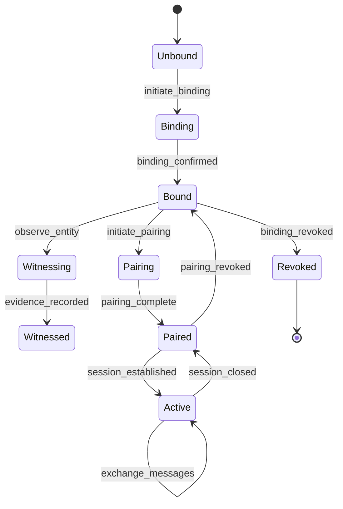

# Manus Instructions V2: Web4 Standard Enhancement Post-Review

## Context

You (Manus) have created an excellent initial Web4 standard framework in `/web4-standard/`. Two independent reviews (Claude and Nova) have identified critical enhancements needed. Nova is separately providing core handshake protocols and LCT/ATP specifications.

This document provides precise instructions for enhancing the Web4 standard based on the review feedback.

## Priority 0: Critical Protocol Specifications

### 1. Integrate Web4's Unique Mechanisms

The current standard reads like a generic DID/VC pairing spec. Web4's revolutionary aspects are missing. Add these as first-class protocol elements:

#### 1.1 Four Entity Relationship Mechanisms

Create `/protocols/web4-entity-relationships.md` with formal specifications for:

**BINDING** (Permanent Identity Attachment)
```abnf
binding-request = binding-version SP entity-type SP public-key SP hardware-id
binding-response = binding-version SP lct-id SP binding-proof
binding-version = "BIND/1.0"
entity-type = "DEVICE" / "SERVICE" / "USER" / "ORACLE"
hardware-id = 64*64HEXDIG  ; SHA-256 of hardware characteristics
binding-proof = signature over (entity-type / public-key / hardware-id / timestamp)
```

**PAIRING** (Authorized Operational Relationships)
```abnf
pairing-request = pairing-version SP lct-a SP lct-b SP context SP rules
pairing-response = pairing-version SP session-id SP key-half-a SP key-half-b
pairing-version = "PAIR/1.0"
context = quoted-string  ; "energy-management", "data-exchange", etc.
rules = "{" rule-list "}"
key-half-a = base64(32-bytes)  ; For symmetric key derivation
key-half-b = base64(32-bytes)
```

**WITNESSING** (Trust Building Through Observation)
```abnf
witness-assertion = witness-version SP observer-lct SP observed-lct SP evidence
witness-version = "WTNS/1.0"
evidence = evidence-type SP evidence-data SP signature
evidence-type = "EXISTENCE" / "ACTION" / "STATE" / "TRANSITION"
; Creates bidirectional MRH tensor links
```

**BROADCAST** (Unidirectional Discovery)
```abnf
broadcast-message = broadcast-version SP sender-id SP message-type SP payload
broadcast-version = "CAST/1.0"
sender-id = entity-type ":" local-identifier
message-type = "ANNOUNCE" / "HEARTBEAT" / "CAPABILITY"
; No acknowledgment required, no relationship formed
```

#### 1.2 MRH Tensor Formal Specification

Create `/core-spec/mrh-tensors.md`:

```json
{
  "mrh_tensor": {
    "entity_lct": "lct:web4:...",
    "links": [
      {
        "target_lct": "lct:web4:...",
        "link_type": "witnessed_by|witnessing|bound_to|paired_with",
        "strength": 0.0-1.0,
        "evidence_count": integer,
        "last_interaction": "iso8601",
        "bidirectional": boolean
      }
    ],
    "trust_metrics": {
      "T3": [capability_dimensions],
      "V3": [value_dimensions]
    },
    "horizon": {
      "max_depth": integer,
      "time_window": "duration",
      "relevance_threshold": 0.0-1.0
    }
  }
}
```

### 2. Cryptographic Suite Implementation

Following Nova's recommendations, update `/core-spec/core-protocol.md` with:

#### 2.1 Algorithm Suites Table
```markdown
| Suite ID          | KEM      | Sig       | AEAD              | Hash    | KDF     | Profile |
|-------------------|----------|-----------|-------------------|---------|---------|---------|
| W4-BASE-1 (MUST)  | X25519   | Ed25519   | ChaCha20-Poly1305 | SHA-256 | HKDF    | COSE    |
| W4-FIPS-1 (SHOULD)| P-256ECDH| ECDSA-P256| AES-128-GCM       | SHA-256 | HKDF    | JOSE    |
| W4-IOT-1 (MAY)    | X25519   | Ed25519   | AES-CCM           | SHA-256 | HKDF    | CBOR    |
```

#### 2.2 Handshake Protocol (HPKE-based)

Replace the current placeholder handshake with:

```
Client                                                   Server
------                                                   ------
ClientHello
  + supported_suites
  + supported_extensions
  + client_public_key
  + client_w4id_ephemeral
  + nonce[32]
  + GREASE_extensions[]
                           -------->
                                                    ServerHello
                                                      + selected_suite
                                                      + selected_extensions
                                                      + server_public_key
                                                      + server_w4id_ephemeral
                                                      + nonce[32]
                                                      + encrypted_credentials
                           <--------
ClientFinished
  + encrypted{client_credentials}
  + MAC(transcript)
                           -------->
                                                    ServerFinished
                                                      + MAC(transcript)
                                                      + session_id
                           <--------

[Application Data]         <------->         [Application Data]
```

### 3. Privacy-Preserving Identifiers

Update `/core-spec/data-formats.md` with pairwise W4ID derivation:

```python
def derive_pairwise_w4id(master_secret: bytes, peer_identifier: str) -> str:
    """Derive a pairwise pseudonymous W4ID for privacy"""
    salt = sha256(peer_identifier.encode()).digest()
    pairwise_key = hkdf(
        master_secret,
        salt=salt,
        info=b"web4-pairwise-id",
        length=32
    )
    return f"w4id:pair:{base32_encode(pairwise_key[:16])}"
```

### 4. LCT Object Definition

Create `/protocols/web4-lct.md` with:

```typescript
interface LCT {
  // Identity
  lct_id: string;                    // Globally unique identifier
  subject: string;                    // Entity this LCT represents
  
  // Binding (PERMANENT)
  binding: {
    entity_type: "device" | "service" | "user" | "oracle";
    public_key: string;               // Current public key (Base64)
    hardware_anchor?: string;         // Hardware identity proof
    created_at: string;               // ISO 8601
    binding_proof: string;            // Signature over binding
  };
  
  // Lineage
  lineage: Array<{
    parent_lct?: string;              // Previous LCT if upgraded
    reason: "genesis" | "rotation" | "fork" | "upgrade";
    timestamp: string;
    witness_lcts: string[];           // Who witnessed this transition
  }>;
  
  // Trust Accumulation
  witness_history: Array<{
    witness_lct: string;
    witness_type: "existence" | "action" | "state" | "quality";
    timestamp: string;
    evidence: string;                 // Signature or proof
    trust_delta: number;              // Impact on trust score
  }>;
  
  // Capabilities and Constraints
  capabilities: {
    protocols: string[];              // Supported protocols/extensions
    resources: ResourceQuota[];       // ATP/ADP quotas
    roles: string[];                  // Authorized roles
  };
  
  // Revocation
  revocation?: {
    revoked_at: string;
    reason: string;
    successor_lct?: string;           // If migrated
    final_state: string;              // Last known good state
  };
}
```

## Priority 1: Fix Critical Issues

### 1. URI Scheme Correction

Update `/architecture/grammar_and_notation.md`:

```abnf
; Option 1: Clean web4:// scheme
web4-URI = "web4://" w4-authority path-abempty [ "?" query ] [ "#" fragment ]
w4-authority = w4id-label / hostname
w4id-label = "w4-" base32nopad   ; base32 encoding of pairwise W4ID

; Option 2: Use DID URLs (RECOMMENDED)
web4-did-url = did-url
did-url = "did:web4:" method-specific-id [ path ] [ "?" query ] [ "#" fragment ]
method-specific-id = base32nopad
```

### 2. Message Canonicalization

Add to `/core-spec/data-formats.md`:

```javascript
// JSON Canonicalization Scheme (JCS) - RFC 8785
function canonicalizeJSON(obj) {
  return JSON.stringify(obj, Object.keys(obj).sort());
}

// CBOR Deterministic Encoding
function canonicalizeCBOR(obj) {
  // 1. Integers use smallest possible encoding
  // 2. Maps sorted by key encoding
  // 3. Indefinite-length items use definite-length
  // 4. No duplicate keys in maps
  return cbor.encode(obj, {canonical: true});
}
```

### 3. State Machines

Add to each protocol in `/protocols/`:



### 4. Error Taxonomy

Create `/core-spec/errors.md`:

```json
{
  "type": "https://web4.dev/errors/",
  "title": "Binding Failed",
  "status": 409,
  "code": "W4_ERR_BINDING_EXISTS",
  "detail": "Entity already has an active binding",
  "instance": "/bindings/device-12345",
  "extensions": {
    "existing_lct": "lct:web4:abc123",
    "suggested_action": "revoke_existing"
  }
}
```

Error codes:
- W4_ERR_BINDING_* (binding errors)
- W4_ERR_PAIRING_* (pairing errors)
- W4_ERR_WITNESS_* (witnessing errors)
- W4_ERR_TRUST_* (trust validation errors)
- W4_ERR_CRYPTO_* (cryptographic errors)

## Priority 2: Implementation Enhancements

### 1. Update Reference Implementation

Enhance `/implementation/reference/web4_client.py`:

```python
import nacl.utils
import nacl.secret
import nacl.signing
import nacl.encoding
from cryptography.hazmat.primitives.kdf.hkdf import HKDF

class Web4Entity:
    def __init__(self, entity_type: str, hardware_id: Optional[str] = None):
        # Separate keys for different purposes
        self.binding_key = nacl.signing.SigningKey.generate()  # Long-term identity
        self.pairing_keys = {}  # Ephemeral session keys per peer
        self.witness_log = []    # Accumulated witness evidence
        self.mrh_tensor = {}     # Bidirectional relationship links
        
        # Generate pairwise identifiers for privacy
        self.master_secret = nacl.utils.random(32)
        self.pairwise_ids = {}
        
        # Binding to hardware if applicable
        self.hardware_id = hardware_id
        self.lct = self.create_binding(entity_type)
    
    def create_binding(self, entity_type: str) -> LCT:
        """Create permanent binding between entity and LCT"""
        # Implementation following formal spec above
        pass
    
    def initiate_pairing(self, peer_lct: str, context: str) -> PairingSession:
        """Establish authorized operational relationship"""
        # Implement pairing protocol with key halves
        pass
    
    def witness_entity(self, observed_lct: str, evidence: Evidence) -> WitnessRecord:
        """Build trust through observation"""
        # Create bidirectional MRH tensor links
        pass
    
    def broadcast_presence(self, message_type: str, payload: dict) -> None:
        """Unidirectional announcement without relationship"""
        # Simple broadcast, no acknowledgment expected
        pass
```

### 2. Test Vectors from Modbatt-CAN

Create `/testing/test-vectors/modbatt-can-vectors.json`:

Use actual data from modbatt-CAN implementation:
- Real binding keys from pack controller
- Actual CAN message broadcasts
- Witnessed pairing sequences
- Trust accumulation over time

### 3. Conformance Profiles

Create `/profiles/` with:

1. **edge-device-profile.md** - For IoT/embedded (CBOR, CoAP, BLE)
2. **cloud-service-profile.md** - For web services (JSON, HTTPS, OAuth)
3. **blockchain-bridge-profile.md** - For on-chain anchoring
4. **peer-to-peer-profile.md** - For direct device communication

## Integration with Nova's Contributions

When Nova provides:
1. **Core Handshake section** → Merge into `/protocols/web4-handshake.md`
2. **LCT object + ATP metering** → Enhance with our binding/witnessing semantics
3. **Security analysis** → Incorporate into `/core-spec/security-framework.md`

## Validation Checklist

After changes, ensure:

- [ ] All four relationship types (binding/pairing/witnessing/broadcast) are specified
- [ ] MRH tensors and bidirectional links are formally defined
- [ ] Privacy-preserving pairwise IDs are implemented
- [ ] Cryptographic suites follow Nova's recommendations
- [ ] URI scheme is RFC-3986 compliant
- [ ] State machines exist for all protocols
- [ ] Error taxonomy is complete
- [ ] Test vectors from modbatt-CAN are included
- [ ] At least 3 conformance profiles are defined
- [ ] Reference implementation demonstrates all mechanisms

## Output Structure

Maintain existing structure but add:
```
web4-standard/
├── protocols/
│   ├── web4-binding.md         # NEW: Formal binding spec
│   ├── web4-pairing.md         # NEW: Formal pairing spec
│   ├── web4-witnessing.md      # NEW: Formal witnessing spec
│   ├── web4-broadcast.md       # NEW: Formal broadcast spec
│   ├── web4-lct.md            # NEW: LCT specification
│   └── web4-handshake.md      # UPDATED: From Nova
├── core-spec/
│   ├── mrh-tensors.md         # NEW: MRH formal spec
│   └── errors.md              # NEW: Error taxonomy
├── profiles/                   # NEW: Conformance profiles
├── testing/
│   └── test-vectors/
│       └── modbatt-can-vectors.json  # NEW: Real-world vectors
```

## Success Criteria

The enhanced standard is complete when:
1. An implementer can build a compliant Web4 entity without reading our other docs
2. The unique value of Web4 (witnessed presence, trust accumulation) is clear
3. Security and privacy are formally analyzed and addressed
4. Multiple implementation profiles support diverse use cases
5. Test vectors enable conformance validation

**Remember**: The goal is not just another DID/VC spec, but the foundation for witnessed digital presence that makes entities witness-hardened through accumulated observation.