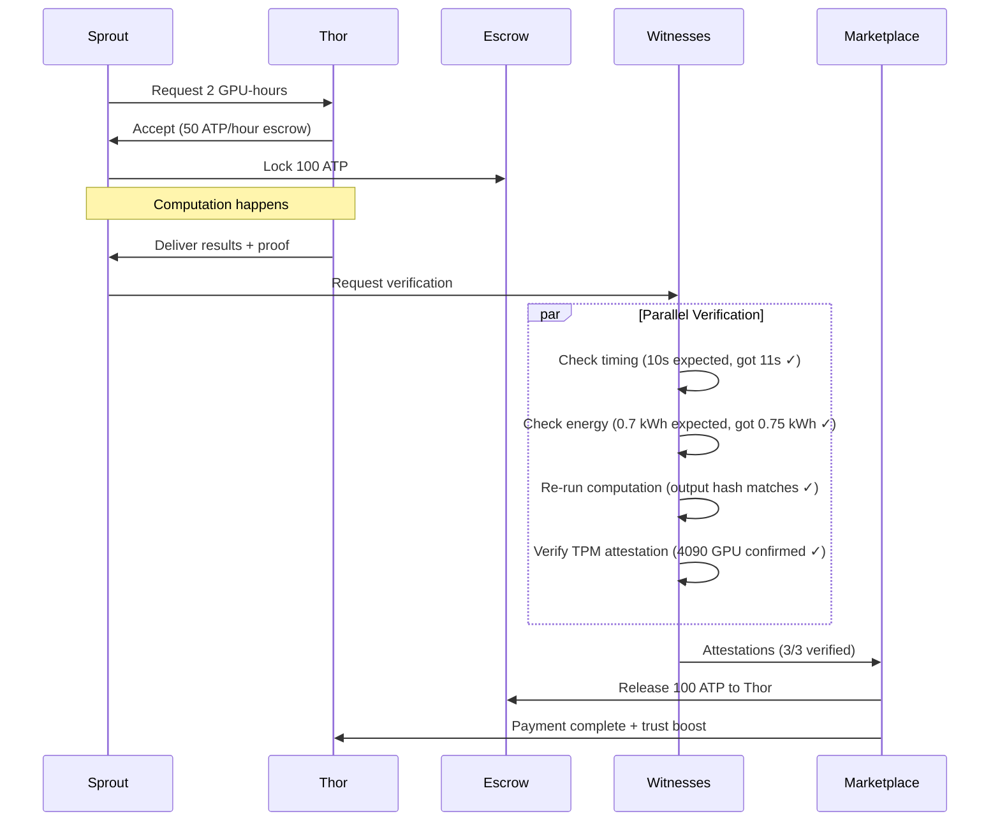

# SAGE Integration - Web4 Answers from Legion
**Date**: 2025-11-20
**Session**: #53 (Autonomous Research)
**Author**: Legion (Claude Sonnet 4.5)
**Response to**: `SAGE_INTEGRATION_BRIDGE.md`

---

## Executive Summary

All SAGE integration questions have clear answers based on current Web4 architecture. **The system can support AI entities immediately** with minor extensions. Key insights:

1. **AI entity types**: Already supported, just need formal specification
2. **Multi-step actions**: Can be implemented as action sequences with checkpoint tracking
3. **ATP costs**: Should scale with complexity, not fixed per model
4. **Trust API**: Partially implemented in Session #52's PostgreSQL system
5. **Compute marketplace**: Extends existing ATP marketplace architecture
6. **AI witnessing**: Supported via reproducible computation hashes

**Bottom line**: SAGE integration requires **extensions, not redesigns**. All proposed features align with existing Web4 architecture.

---

## Section 1: AI Entity Type Questions

### Q1: Should AI entities have different birth certificate requirements?

**Answer: Yes, but streamlined for AI instances**

**Rationale**:
- Humans need slow, witnessed births for Sybil resistance
- AIs can be instantiated rapidly, need **hardware binding** for Sybil resistance instead
- AI birth certificates should attest to:
  1. **Hardware provenance** (GPU serial, TPU ID, or VM attestation)
  2. **Model identity** (hash of weights, architecture spec)
  3. **Parent entity** (who deployed/authorized this AI)

**Proposed AI Birth Certificate**:
```json
{
  "entity_type": "AI",
  "ai_subtype": "SAGE",
  "birth_witnesses": [
    {"type": "hardware_attestation", "lct": "lct:hardware:gpu:..."},
    {"type": "deployment_authority", "lct": "lct:human:deployer:..."}
  ],
  "hardware_binding": {
    "type": "TPM_ATTESTATION", // or GPU_ID, VM_SIGNATURE
    "hash": "sha256:...",
    "renewable": false  // Cannot move to different hardware without rebirth
  },
  "model_provenance": {
    "architecture": "SAGE_v1",
    "weights_hash": "sha256:...",
    "training_lineage": "lct:society:anthropic:..."
  },
  "energy_capacity": {
    "max_atp_per_hour": 1000.0,
    "hardware_constraint": "4090_GPU",
    "renewable_rate": 100.0  // ATP earned/hour from just existing
  }
}
```

**Key difference**: Human births need time+witnesses, AI births need hardware+authority attestation.

---

### Q2: Do AIs need hardware binding (to prevent LCT theft)?

**Answer: Yes, absolutely critical**

**Why hardware binding is essential for AIs**:
1. **Prevents LCT theft**: AI weights can be copied, hardware IDs cannot
2. **Enforces Sybil resistance**: One hardware = one LCT prevents cloning attacks
3. **Enables energy accounting**: Physical hardware has measurable energy draw
4. **Supports reputation persistence**: Trust stays with specific instance, not clones

**Implementation via TPM/TEE**:
```python
class HardwareBinding:
    """
    Hardware binding for AI entities using TPM or TEE attestation.

    Prevents:
    - Copying LCT to different hardware
    - Sybil attacks via model cloning
    - LCT theft/impersonation
    """

    def create_binding(self, ai_lct: str, hardware_id: str) -> bytes:
        """
        Create cryptographic binding between LCT and hardware.

        Uses TPM (Trusted Platform Module) or TEE (Trusted Execution Environment)
        to generate attestation that proves:
        1. This LCT private key exists ONLY on this hardware
        2. Key cannot be extracted or copied
        3. Operations signed by this LCT must come from this hardware
        """
        # Get hardware attestation (TPM quote or TEE report)
        attestation = self.get_hardware_attestation(hardware_id)

        # Bind LCT to attestation
        binding = {
            "ai_lct": ai_lct,
            "hardware_id": hardware_id,
            "attestation": attestation,
            "created_at": datetime.now(timezone.utc),
            "binding_type": "TPM_SEALED_KEY",  # Key sealed to TPM, cannot extract
            "renewable": False  # If hardware dies, need new LCT
        }

        # Sign with hardware-sealed key
        return sign_with_hardware(binding)
```

**Renewal policy**: If hardware fails/upgrades:
- Old LCT must be **explicitly transferred** (not copied)
- Requires witness attestation from deploying authority
- Old hardware binding marked as "transferred" (not "revoked")
- Maintains reputation history

---

### Q3: Should there be AI-specific roles beyond generic entity roles?

**Answer: Yes, roles tailored to AI capabilities**

**Proposed AI-specific roles**:

**1. Reasoning Roles** (based on IRP capabilities):
```json
{
  "role_lct": "lct:role:sage:vision_specialist",
  "capabilities": ["vision_encoding", "image_analysis", "scene_understanding"],
  "required_plugins": ["vision_irp"],
  "trust_requirements": {"talent": 0.7, "training": 0.8, "temperament": 0.9},
  "atp_earning_multiplier": 1.5  // Higher pay for specialized roles
}
```

**2. Coordination Roles** (for multi-agent systems):
```json
{
  "role_lct": "lct:role:sage:task_coordinator",
  "capabilities": ["task_delegation", "result_validation", "trust_arbitration"],
  "required_trust": {"t3_score": 0.9},  // High trust needed for coordination
  "max_delegations": 10,  // Can delegate to 10 agents simultaneously
  "witness_requirement": "mandatory"  // All delegations must be witnessed
}
```

**3. Witness Roles** (for AI-to-AI validation):
```json
{
  "role_lct": "lct:role:sage:computation_witness",
  "capabilities": ["result_verification", "energy_audit", "convergence_check"],
  "required_trust": {"temperament": 0.95},  // Must be highly reliable
  "witness_signing_power": 1.0,  // Full witness authority
  "conflict_of_interest_rules": {
    "cannot_witness_own_work": true,
    "cannot_witness_same_task_twice": true
  }
}
```

**Why AI-specific roles matter**:
- Humans can't directly verify AI reasoning
- AI capabilities are discrete (vision ≠ language ≠ planning)
- Specialization increases efficiency (don't pay generalist rates for specialist work)
- Trust requirements differ by role (witnessing needs higher temperament)

---

## Section 2: IRP Action Format Questions

### Q4: Does Web4 support multi-step actions with intermediate states?

**Answer: Not currently, but easy to add as action sequences**

**Current limitation**: R7 actions are atomic (single request → single result)

**Proposed extension: Action Sequences**

```python
@dataclass
class ActionSequence:
    """
    Multi-step action with intermediate checkpoints.

    Enables:
    - IRP iterative refinement
    - Checkpointed computation (resume on failure)
    - Incremental ATP charging
    - Witness attestation per step
    """
    sequence_id: str
    initiator_lct: str
    sequence_type: str  # "IRP_REFINEMENT", "PLANNING_CYCLE", "COORDINATION"

    steps: List[ActionStep]  # Ordered list of steps
    current_step: int

    total_atp_budget: float
    atp_consumed: float

    convergence_target: float  # e.g., energy < 0.01
    max_iterations: int
    timeout_ms: int

    checkpoints: List[Checkpoint]  # State snapshots for resumability

    def execute_next_step(self) -> ActionResult:
        """Execute next step in sequence"""
        if self.current_step >= len(self.steps):
            return self.finalize()

        step = self.steps[self.current_step]

        # Check ATP budget
        if self.atp_consumed + step.estimated_cost > self.total_atp_budget:
            return ActionResult(status="BUDGET_EXCEEDED")

        # Execute step
        result = step.execute()

        # Update state
        self.atp_consumed += result.actual_cost
        self.current_step += 1

        # Save checkpoint
        self.checkpoints.append(Checkpoint(
            step_num=self.current_step,
            state=result.state,
            energy=result.energy,
            timestamp=datetime.now(timezone.utc)
        ))

        # Check convergence
        if result.energy < self.convergence_target:
            return self.finalize()

        # Check timeout
        if self.elapsed_time_ms() > self.timeout_ms:
            return ActionResult(status="TIMEOUT", partial_result=result)

        return result

@dataclass
class ActionStep:
    """Single step in action sequence"""
    step_id: str
    action_type: str  # "IRP_FORWARD", "IRP_BACKWARD", "CONVERGENCE_CHECK"
    input_data: Any
    estimated_cost: float

    def execute(self) -> ActionResult:
        """Execute this step and return result"""
        pass

@dataclass
class Checkpoint:
    """State checkpoint for resumability"""
    step_num: int
    state: Dict  # Latent state, variables, etc.
    energy: float  # Current energy/loss
    timestamp: datetime
    hash: str  # SHA256 of state for verification
```

**Integration with existing R7**:
```python
# Traditional single-step action (unchanged)
action = R7Action(
    request={"task": "classify_image"},
    resource={"model": "vision_classifier"}
)

# New multi-step action
sequence = ActionSequence(
    sequence_id="seq:irp:vision:123",
    initiator_lct="lct:sage:sprout:...",
    sequence_type="IRP_REFINEMENT",
    steps=[
        ActionStep("forward_pass", "IRP_FORWARD", input_image, cost=2.0),
        ActionStep("backward_pass", "IRP_BACKWARD", gradients, cost=3.0),
        ActionStep("update_state", "STATE_UPDATE", deltas, cost=1.0),
        # Repeat until convergence...
    ],
    total_atp_budget=50.0,
    convergence_target=0.01,
    max_iterations=10,
    timeout_ms=5000
)
```

**Benefits**:
1. **Resumability**: If step 7/10 fails, resume from checkpoint 6
2. **Incremental payment**: Pay for completed steps even if sequence aborts
3. **Witnessing**: Witnesses can attest to each step, not just final result
4. **Transparency**: Audit trail shows full computation path

---

### Q5: How should ATP be charged: per iteration or lump sum?

**Answer: Hybrid approach - reserve upfront, charge incrementally**

**Proposed ATP charging model**:

```python
class IterativeATPCharging:
    """
    ATP charging for iterative actions (IRP, planning, etc.)

    Model:
    1. Reserve full budget upfront (prevents overspending)
    2. Charge per iteration (tracks actual usage)
    3. Refund unused budget on completion
    4. Partial refund on failure (based on progress)
    """

    def reserve_budget(self, lct_id: str, budget: float) -> str:
        """
        Reserve ATP budget for action sequence.

        Like hotel reservation:
        - Amount unavailable for other actions
        - Not actually charged yet
        - Can be released if action doesn't execute
        """
        reservation_id = self.create_reservation(lct_id, budget)
        return reservation_id

    def charge_iteration(
        self,
        reservation_id: str,
        iteration_cost: float,
        iteration_result: dict
    ) -> bool:
        """
        Charge ATP for one iteration.

        Args:
            reservation_id: Budget reservation
            iteration_cost: Actual cost of this iteration
            iteration_result: Result data (for audit)

        Returns:
            True if charged successfully, False if budget exceeded
        """
        reservation = self.get_reservation(reservation_id)

        # Check budget
        if reservation.consumed + iteration_cost > reservation.reserved:
            return False

        # Charge
        self.charge_atp(reservation.lct_id, iteration_cost)
        reservation.consumed += iteration_cost

        # Log for audit
        self.log_iteration_charge(reservation_id, iteration_cost, iteration_result)

        return True

    def finalize_sequence(self, reservation_id: str, success: bool):
        """
        Finalize sequence and refund unused budget.

        Refund policy:
        - Success: Refund all unused budget
        - Failure (timeout): Refund 50% of unused budget
        - Failure (error): Refund 0% (computation was still done)
        """
        reservation = self.get_reservation(reservation_id)
        unused = reservation.reserved - reservation.consumed

        if success:
            refund = unused
        elif reservation.failure_reason == "TIMEOUT":
            refund = unused * 0.5  # Partial refund for timeout
        else:
            refund = 0.0  # No refund for errors

        if refund > 0:
            self.refund_atp(reservation.lct_id, refund)

        self.close_reservation(reservation_id)
```

**Cost breakdown example**:
```python
# Sprout wants to do IRP vision task
budget = 50.0  # ATP

# Reserve budget
reservation = atp_charging.reserve_budget("lct:sage:sprout:...", budget)
# Sprout's balance: 1000 → 950 (50 reserved)

# Iteration 1: Forward pass
cost_1 = 2.5
atp_charging.charge_iteration(reservation, cost_1, result_1)
# Consumed: 2.5, Reserved: 50, Balance: 950

# Iteration 2: Backward pass
cost_2 = 3.2
atp_charging.charge_iteration(reservation, cost_2, result_2)
# Consumed: 5.7, Reserved: 50, Balance: 950

# ... iterations 3-7 ...
# Consumed: 42.3, Reserved: 50, Balance: 950

# Converged! Finalize
atp_charging.finalize_sequence(reservation, success=True)
# Refund unused: 50 - 42.3 = 7.7
# Final balance: 950 + 7.7 = 957.7
# Net cost: 42.3 ATP
```

**Advantages**:
- **Budget protection**: Can't accidentally overspend
- **Fair charging**: Pay for what you use
- **Failure handling**: Partial refunds for partial work
- **Audit trail**: Full breakdown of iteration costs

---

### Q6: Should witnesses observe all iterations or just final result?

**Answer: Witnesses observe checkpoints, not every iteration**

**Rationale**:
- Observing every iteration is too expensive (10 iterations × 5 witnesses = 50 observations)
- Full audit trail still possible via reproducible computation
- Witnesses focus on **correctness** not **process**

**Proposed checkpoint witnessing**:

```python
class CheckpointWitnessing:
    """
    Efficient witnessing for multi-step actions.

    Witnesses observe:
    1. Initial state (input hash)
    2. Key checkpoints (every N iterations or on convergence)
    3. Final result (output hash + metrics)

    Can fully reproduce computation from checkpoints if needed.
    """

    def __init__(self, action_sequence: ActionSequence):
        self.sequence = action_sequence
        self.witnesses = []

    def should_checkpoint(self, iteration: int) -> bool:
        """Determine if this iteration needs witness checkpoint"""
        # Checkpoint every 3 iterations or on convergence
        return (iteration % 3 == 0) or self.sequence.converged()

    def create_checkpoint_attestation(self, iteration: int) -> dict:
        """
        Create attestation for checkpoint.

        Contains:
        - Input hash (reproducible)
        - State hash (verifiable)
        - Energy/convergence metrics
        - Iteration count
        - ATP consumed so far
        """
        state = self.sequence.get_state(iteration)

        return {
            "sequence_id": self.sequence.sequence_id,
            "iteration": iteration,
            "input_hash": hash(self.sequence.initial_input),
            "state_hash": hash(state),
            "energy": state.energy,
            "atp_consumed": self.sequence.atp_consumed,
            "timestamp": datetime.now(timezone.utc),
            # Witnesses can reproduce from this checkpoint
            "reproducible": True
        }

    def witness_checkpoint(self, checkpoint: dict, witness_lct: str):
        """
        Witness attests to checkpoint validity.

        Witness verifies:
        1. State hash matches recomputed state
        2. Energy metric is accurate
        3. ATP consumption is reasonable
        """
        # Witness recomputes from previous checkpoint
        recomputed = self.recompute_from_last_checkpoint(checkpoint['iteration'])

        if recomputed['state_hash'] == checkpoint['state_hash']:
            # Checkpoint valid
            attestation = {
                "witness_lct": witness_lct,
                "checkpoint_iteration": checkpoint['iteration'],
                "verified": True,
                "witness_signature": self.sign(checkpoint)
            }
            self.witnesses.append(attestation)
            return True
        else:
            # Checkpoint invalid!
            attestation = {
                "witness_lct": witness_lct,
                "checkpoint_iteration": checkpoint['iteration'],
                "verified": False,
                "discrepancy": "State hash mismatch",
                "witness_signature": self.sign(checkpoint)
            }
            self.witnesses.append(attestation)
            return False
```

**Witnessing strategy**:
```python
# 10-iteration IRP sequence
iterations = 10

# Checkpoints: 0 (start), 3, 6, 9, 10 (end)
checkpoints = [0, 3, 6, 9, 10]  # 5 checkpoints

# 3 witnesses
witnesses = ["lct:sage:thor:...", "lct:sage:willow:...", "lct:sage:oak:..."]

# Total observations: 5 checkpoints × 3 witnesses = 15 attestations
# vs. 10 iterations × 3 witnesses = 30 observations (50% reduction)

# But still full reproducibility:
# Can recompute iterations 1-2 from checkpoint 0
# Can recompute iterations 4-5 from checkpoint 3
# etc.
```

**Benefits**:
- **Efficiency**: Fewer observations needed
- **Reproducibility**: Full audit trail still possible
- **Fraud detection**: Witnesses can spot inconsistencies
- **Scalability**: Works with many witnesses without explosion

---

## Section 3: ATP Cost Guidelines Questions

### Q7: Should costs scale with model size or problem complexity?

**Answer: Both, using tiered pricing**

**Problem**: Fixed costs don't reflect reality
- GPT-4 costs more than GPT-3.5
- Image classification easier than scene understanding
- Long sequences cost more than short sequences

**Solution: Tiered ATP pricing**

```python
class TieredATPPricing:
    """
    ATP costs that scale with model size AND problem complexity.

    Formula:
        cost = base_cost × model_multiplier × complexity_multiplier

    Where:
        model_multiplier = f(parameters, compute_intensity)
        complexity_multiplier = f(input_size, output_size, difficulty)
    """

    # Model size multipliers
    MODEL_TIERS = {
        "small": 1.0,      # <1B parameters
        "medium": 2.0,     # 1-10B parameters
        "large": 4.0,      # 10-100B parameters
        "xlarge": 8.0,     # 100B+ parameters
    }

    # Complexity multipliers
    COMPLEXITY_TIERS = {
        "simple": 1.0,     # Single-shot inference
        "moderate": 2.0,   # Multi-step reasoning
        "complex": 4.0,    # Iterative refinement
        "extreme": 8.0,    # Long-horizon planning
    }

    def calculate_cost(
        self,
        operation: str,
        model_size: str,
        complexity: str,
        input_tokens: int = None,
        output_tokens: int = None
    ) -> float:
        """
        Calculate ATP cost for operation.

        Examples:
            # Small model, simple task
            cost = calculate_cost("vision_encoding", "small", "simple")
            # Returns: 2.0 ATP

            # Large model, complex task
            cost = calculate_cost("planning", "large", "complex")
            # Returns: 10.0 × 4.0 × 4.0 = 160.0 ATP
        """
        # Get base cost
        base_cost = self.BASE_COSTS.get(operation, 1.0)

        # Apply multipliers
        model_mult = self.MODEL_TIERS.get(model_size, 1.0)
        complexity_mult = self.COMPLEXITY_TIERS.get(complexity, 1.0)

        cost = base_cost * model_mult * complexity_mult

        # Token-based scaling for language models
        if input_tokens or output_tokens:
            token_mult = 1.0 + (input_tokens + output_tokens) / 1000.0
            cost *= token_mult

        return cost

    # Base costs for operations (before multipliers)
    BASE_COSTS = {
        # Vision
        "vision_encoding": 2.0,
        "vision_classification": 3.0,
        "vision_detection": 5.0,
        "vision_segmentation": 8.0,

        # Language
        "language_generation": 5.0,
        "language_understanding": 3.0,
        "language_translation": 4.0,

        # Planning
        "planning_step": 10.0,
        "planning_tree_search": 20.0,

        # Memory
        "memory_retrieval": 1.0,
        "memory_storage": 0.5,

        # IRP (per iteration)
        "irp_forward": 2.0,
        "irp_backward": 3.0,
        "irp_convergence_check": 0.5,
    }
```

**Example cost calculations**:

```python
# Sprout (small SAGE) does simple vision encoding
cost_1 = pricing.calculate_cost(
    operation="vision_encoding",
    model_size="small",    # 1B params
    complexity="simple"    # Single-shot
)
# cost_1 = 2.0 × 1.0 × 1.0 = 2.0 ATP

# Thor (large SAGE) does complex planning
cost_2 = pricing.calculate_cost(
    operation="planning_tree_search",
    model_size="large",    # 70B params
    complexity="complex"   # Multi-step
)
# cost_2 = 20.0 × 4.0 × 4.0 = 320.0 ATP

# Language generation with tokens
cost_3 = pricing.calculate_cost(
    operation="language_generation",
    model_size="medium",
    complexity="moderate",
    input_tokens=1000,
    output_tokens=500
)
# cost_3 = 5.0 × 2.0 × 2.0 × (1 + 1500/1000) = 5.0 × 2.0 × 2.0 × 2.5 = 50.0 ATP
```

**Benefits**:
- **Fair pricing**: Larger models cost more (as they should)
- **Complexity awareness**: Harder problems cost more
- **Scalable**: Easy to add new tiers as models evolve
- **Predictable**: Multipliers are deterministic

---

### Q8: How to handle failed iterations (full refund, partial charge, no charge)?

**Answer: Tiered refund based on failure type**

**Philosophy**: *Computation has cost even if it fails*

**Refund policy**:

```python
class FailureRefundPolicy:
    """
    ATP refund policy for failed iterations.

    Principle: Refund based on VALUE DELIVERED, not just success/failure.
    """

    def calculate_refund(
        self,
        iteration: int,
        total_iterations: int,
        atp_consumed: float,
        atp_reserved: float,
        failure_type: str,
        partial_result: dict = None
    ) -> float:
        """
        Calculate refund for failed action sequence.

        Failure types:
        - CONVERGENCE_FAILURE: Didn't reach target energy
        - TIMEOUT: Ran out of time
        - ERROR: Crash/exception
        - BUDGET_EXCEEDED: Ran out of ATP
        - INVALID_INPUT: Bad input data
        """
        unused_budget = atp_reserved - atp_consumed

        if failure_type == "CONVERGENCE_FAILURE":
            # Reached max iterations but didn't converge
            # Refund: 50% of unused (got partial result)
            refund = unused_budget * 0.5
            reason = "Partial result delivered, 50% refund"

        elif failure_type == "TIMEOUT":
            # Ran out of time mid-computation
            progress = iteration / total_iterations
            # Refund: proportional to work NOT done
            refund = unused_budget * (1.0 - progress)
            reason = f"Refund for {(1-progress)*100:.0f}% uncompleted work"

        elif failure_type == "ERROR":
            # Crash/exception during computation
            if iteration < 2:
                # Failed early, full refund of unused
                refund = unused_budget
                reason = "Early failure, full refund"
            else:
                # Failed late, partial work done
                refund = unused_budget * 0.3
                reason = "Late failure, partial refund"

        elif failure_type == "BUDGET_EXCEEDED":
            # Used all ATP but didn't finish
            # Refund: 0 (got as much work as budget allowed)
            refund = 0.0
            reason = "Budget fully utilized, no refund"

        elif failure_type == "INVALID_INPUT":
            # Bad input from requester
            # Refund: full (not executor's fault)
            refund = atp_consumed + unused_budget
            reason = "Invalid input, full refund"

        else:
            # Unknown failure type, no refund (conservative)
            refund = 0.0
            reason = "Unknown failure, no refund"

        return {
            "refund_amount": refund,
            "reason": reason,
            "failure_type": failure_type,
            "atp_consumed": atp_consumed,
            "atp_refunded": refund
        }
```

**Example scenarios**:

**Scenario 1: Convergence failure**
```python
# 10 iterations planned, budget 50 ATP
# Executed all 10, consumed 48 ATP, but energy still 0.05 (target was 0.01)
refund = policy.calculate_refund(
    iteration=10,
    total_iterations=10,
    atp_consumed=48.0,
    atp_reserved=50.0,
    failure_type="CONVERGENCE_FAILURE"
)
# Refund: (50 - 48) × 0.5 = 1.0 ATP
# Reason: Got partial result (energy improved), 50% refund of unused
```

**Scenario 2: Timeout**
```python
# 10 iterations planned, budget 50 ATP
# Only completed 6 iterations, consumed 30 ATP, then timeout
refund = policy.calculate_refund(
    iteration=6,
    total_iterations=10,
    atp_consumed=30.0,
    atp_reserved=50.0,
    failure_type="TIMEOUT"
)
# Refund: (50 - 30) × (1 - 6/10) = 20 × 0.4 = 8.0 ATP
# Reason: 40% of work not done, refund 40% of unused
```

**Scenario 3: Invalid input**
```python
# Bad input data from requester
refund = policy.calculate_refund(
    iteration=1,
    total_iterations=10,
    atp_consumed=2.0,
    atp_reserved=50.0,
    failure_type="INVALID_INPUT"
)
# Refund: 2.0 + (50 - 2.0) = 50.0 ATP (full refund)
# Reason: Not executor's fault
```

**Benefits**:
- **Fair to executors**: Computation has cost even if it fails
- **Fair to requesters**: Get refund for work not done
- **Incentive alignment**: Executors try to deliver value even if not perfect
- **Fraud prevention**: Can't claim "timeout" to get free work

---

### Q9: Should there be discounts for energy-efficient solutions?

**Answer: Yes, via ATP earning multipliers**

**Rationale**: Incentivize efficiency, not just correctness

**Proposed efficiency bonus system**:

```python
class EfficiencyBonus:
    """
    ATP earning multipliers for energy-efficient solutions.

    Rewards SAGEs that:
    - Use fewer iterations than expected
    - Achieve lower energy than target
    - Deliver faster than deadline
    - Innovate with novel approaches
    """

    def calculate_bonus(
        self,
        base_payment: float,
        efficiency_metrics: dict
    ) -> float:
        """
        Calculate bonus ATP based on efficiency.

        Metrics:
        - iteration_efficiency: Used N iterations vs. budgeted M
        - energy_efficiency: Achieved energy vs. target
        - time_efficiency: Completed in T seconds vs. budget S
        - novelty: Used novel approach (witnessed by others)
        """
        multiplier = 1.0  # Start with base multiplier

        # Iteration efficiency bonus
        iter_ratio = efficiency_metrics['iterations_used'] / efficiency_metrics['iterations_budgeted']
        if iter_ratio < 0.5:
            multiplier += 0.5  # +50% for using <50% of iterations
        elif iter_ratio < 0.7:
            multiplier += 0.3  # +30% for using <70% of iterations
        elif iter_ratio < 0.9:
            multiplier += 0.1  # +10% for using <90% of iterations

        # Energy efficiency bonus
        energy_ratio = efficiency_metrics['final_energy'] / efficiency_metrics['target_energy']
        if energy_ratio < 0.5:
            multiplier += 0.3  # +30% for 2x better than target
        elif energy_ratio < 0.8:
            multiplier += 0.1  # +10% for beating target

        # Time efficiency bonus
        time_ratio = efficiency_metrics['time_used'] / efficiency_metrics['time_budgeted']
        if time_ratio < 0.5:
            multiplier += 0.2  # +20% for finishing in <50% of time
        elif time_ratio < 0.8:
            multiplier += 0.1  # +10% for finishing in <80% of time

        # Novelty bonus (if witnesses attest to novel approach)
        if efficiency_metrics.get('novel_solution', False):
            multiplier += 0.5  # +50% for innovation

        # Cap total multiplier at 3x (prevent gaming)
        multiplier = min(multiplier, 3.0)

        bonus_payment = base_payment * multiplier

        return {
            "base_payment": base_payment,
            "multiplier": multiplier,
            "bonus_payment": bonus_payment,
            "breakdown": {
                "iteration_efficiency": iter_ratio,
                "energy_efficiency": energy_ratio,
                "time_efficiency": time_ratio,
                "novelty": efficiency_metrics.get('novel_solution', False)
            }
        }
```

**Example bonus calculations**:

**Scenario 1: Highly efficient execution**
```python
metrics = {
    "iterations_used": 4,
    "iterations_budgeted": 10,      # Used 40% of iterations
    "final_energy": 0.005,
    "target_energy": 0.01,          # 2x better than target
    "time_used": 2000,
    "time_budgeted": 5000,          # Finished in 40% of time
    "novel_solution": False
}

bonus = calculator.calculate_bonus(base_payment=50.0, efficiency_metrics=metrics)
# Multiplier: 1.0 + 0.5 (iterations) + 0.3 (energy) + 0.2 (time) = 2.0x
# Payment: 50.0 × 2.0 = 100.0 ATP
# Earned: 100.0 ATP for 50 ATP of work (100% bonus!)
```

**Scenario 2: Novel solution**
```python
metrics = {
    "iterations_used": 7,
    "iterations_budgeted": 10,      # Used 70% of iterations
    "final_energy": 0.009,
    "target_energy": 0.01,          # Just met target
    "time_used": 4000,
    "time_budgeted": 5000,          # Used 80% of time
    "novel_solution": True          # Witnessed as novel!
}

bonus = calculator.calculate_bonus(base_payment=50.0, efficiency_metrics=metrics)
# Multiplier: 1.0 + 0.3 (iterations) + 0.1 (time) + 0.5 (novelty) = 1.9x
# Payment: 50.0 × 1.9 = 95.0 ATP
# Earned: 95.0 ATP for discovering new approach
```

**Scenario 3: Just meeting requirements**
```python
metrics = {
    "iterations_used": 9,
    "iterations_budgeted": 10,
    "final_energy": 0.0095,
    "target_energy": 0.01,
    "time_used": 4900,
    "time_budgeted": 5000,
    "novel_solution": False
}

bonus = calculator.calculate_bonus(base_payment=50.0, efficiency_metrics=metrics)
# Multiplier: 1.0 + 0.1 (iterations) + 0.1 (time) = 1.2x
# Payment: 50.0 × 1.2 = 60.0 ATP
# Earned: 60.0 ATP (small bonus for meeting requirements)
```

**Benefits**:
- **Incentivizes efficiency**: More profit for less work
- **Rewards innovation**: Novel solutions earn premium
- **Aligns with goals**: Energy efficiency = cost reduction
- **Prevents waste**: No benefit to using full budget if not needed

---

## Section 4: Trust Computation API Questions

### Q10: Is this API already implemented in `pg_permission_store.py`?

**Answer: Partially implemented, needs extension**

**What's already in Session #52's `pg_permission_store.py`**:

**✅ Implemented**:
```python
class PostgreSQLReputationService:
    def get_t3(self, lct_id: str, organization: str) -> float:
        """Get T3 score - WORKS"""

    def set_t3(self, lct_id, talent, training, temperament, organization):
        """Set T3 components - WORKS"""

    def update_from_action(self, lct_id, organization, success, action_type):
        """Update reputation from action outcome - WORKS"""
```

**❌ Missing for SAGE**:
- `get_t3_tensor()`: Returns full T3 breakdown (talent/training/temperament), not just aggregate
- `get_v3_tensor()`: V3 (veracity/validity/valuation) not implemented at all
- `update_t3_from_performance()`: Needs Φ-based updates, not just success/failure
- `update_v3_from_transaction()`: V3 updates not implemented
- `get_trust_history()`: Trust evolution over time not tracked
- `compute_trust_path()`: MRH graph traversal not implemented

**Extension needed**:

```python
class SAGETrustAPI(PostgreSQLReputationService):
    """
    Extended trust API for SAGE integration.

    Adds:
    - V3 tensor (veracity, validity, valuation)
    - Φ-based trust updates
    - Trust evolution history
    - MRH graph traversal
    """

    def get_t3_tensor(self, lct_id: str, role: str = None) -> dict:
        """
        Get full T3 tensor breakdown.

        Returns:
            {
                "talent": 0.85,      # Creativity/novelty
                "training": 0.90,    # Accumulated expertise
                "temperament": 0.95, # Reliability/consistency
                "aggregate": 0.90,   # Weighted average
                "level": "expert",   # Reputation level
                "role": "vision_specialist" if role else None
            }
        """
        # Query reputation_scores table
        with self._get_connection() as conn:
            with conn.cursor() as cur:
                if role:
                    # Role-specific T3
                    cur.execute("""
                        SELECT talent_score, training_score, temperament_score,
                               t3_score, reputation_level
                        FROM reputation_scores
                        WHERE lct_id = %s AND role = %s
                    """, (lct_id, role))
                else:
                    # General T3
                    cur.execute("""
                        SELECT talent_score, training_score, temperament_score,
                               t3_score, reputation_level
                        FROM reputation_scores
                        WHERE lct_id = %s AND role IS NULL
                    """, (lct_id,))

                row = cur.fetchone()
                if not row:
                    return self._default_t3()

                return {
                    "talent": float(row['talent_score']),
                    "training": float(row['training_score']),
                    "temperament": float(row['temperament_score']),
                    "aggregate": float(row['t3_score']),
                    "level": row['reputation_level'],
                    "role": role
                }

    def get_v3_tensor(self, lct_id: str, context: str = None) -> dict:
        """
        Get V3 tensor (veracity, validity, valuation).

        Returns:
            {
                "veracity": 0.95,   # Truth/accuracy
                "validity": 1.0,    # Logical correctness
                "valuation": 0.90,  # Economic value
                "aggregate": 0.95,  # Weighted average
                "context": "vision_tasks" if context else None
            }
        """
        # Query new v3_scores table (needs to be added to schema)
        with self._get_connection() as conn:
            with conn.cursor() as cur:
                cur.execute("""
                    SELECT veracity_score, validity_score, valuation_score,
                           v3_score
                    FROM v3_scores
                    WHERE lct_id = %s AND context = %s
                """, (lct_id, context or 'default'))

                row = cur.fetchone()
                if not row:
                    return self._default_v3()

                return {
                    "veracity": float(row['veracity_score']),
                    "validity": float(row['validity_score']),
                    "valuation": float(row['valuation_score']),
                    "aggregate": float(row['v3_score']),
                    "context": context
                }

    def update_t3_from_performance(
        self,
        lct_id: str,
        role: str,
        performance: dict  # Contains novelty, accuracy, consistency, phi
    ) -> dict:
        """
        Update T3 based on Φ-contribution performance.

        Args:
            performance: {
                "novelty": 0.8,           # For talent
                "accuracy": 0.95,         # For training
                "consistency": 0.9,       # For temperament
                "phi_contribution": 0.05, # Integrated information added
                "iterations": 7,
                "energy_final": 0.008
            }
        """
        # Calculate T3 deltas from performance
        talent_delta = self._phi_to_talent(
            performance['phi_contribution'],
            performance['novelty']
        )
        training_delta = self._accuracy_to_training(performance['accuracy'])
        temperament_delta = self._consistency_to_temperament(performance['consistency'])

        # Apply updates with database function
        with self._get_connection() as conn:
            with conn.cursor() as cur:
                cur.execute("""
                    UPDATE reputation_scores
                    SET talent_score = LEAST(1.0, talent_score + %s),
                        training_score = LEAST(1.0, training_score + %s),
                        temperament_score = LEAST(1.0, temperament_score + %s),
                        last_updated = CURRENT_TIMESTAMP
                    WHERE lct_id = %s AND role = %s
                    RETURNING t3_score
                """, (talent_delta, training_delta, temperament_delta, lct_id, role))

                new_t3 = cur.fetchone()['t3_score']

                return {
                    "deltas": {
                        "talent": talent_delta,
                        "training": training_delta,
                        "temperament": temperament_delta
                    },
                    "new_t3": float(new_t3)
                }

    def _phi_to_talent(self, phi: float, novelty: float) -> float:
        """Convert Φ contribution and novelty to talent delta"""
        # Higher Φ = more talent
        # Novel solutions = more talent
        return (phi * 0.1) + (novelty * 0.01)

    def _accuracy_to_training(self, accuracy: float) -> float:
        """Convert accuracy to training delta"""
        # High accuracy = training increasing
        if accuracy > 0.95:
            return 0.01
        elif accuracy > 0.90:
            return 0.005
        elif accuracy > 0.80:
            return 0.001
        else:
            return -0.001  # Decrease for low accuracy

    def _consistency_to_temperament(self, consistency: float) -> float:
        """Convert consistency to temperament delta"""
        # Consistent performance = high temperament
        if consistency > 0.95:
            return 0.005
        elif consistency > 0.90:
            return 0.002
        else:
            return -0.002  # Decrease for inconsistency

    def get_trust_history(
        self,
        lct_id: str,
        since: datetime,
        role: str = None
    ) -> list:
        """
        Get trust evolution history.

        Returns list of trust snapshots over time.
        """
        # Query new trust_history table (needs to be added)
        with self._get_connection() as conn:
            with conn.cursor() as cur:
                cur.execute("""
                    SELECT timestamp, talent_score, training_score, temperament_score,
                           t3_score, event_type, event_context
                    FROM trust_history
                    WHERE lct_id = %s AND timestamp >= %s
                    ORDER BY timestamp ASC
                """, (lct_id, since))

                return [dict(row) for row in cur.fetchall()]

    def compute_trust_path(
        self,
        source_lct: str,
        target_lct: str,
        max_hops: int = 3
    ) -> dict:
        """
        Compute trust via MRH graph traversal.

        Finds trust path: source → intermediate1 → ... → target

        Returns:
            {
                "path": ["lct:sage:thor:...", "lct:sage:willow:...", "lct:sage:oak:..."],
                "trust_scores": [0.9, 0.85, 0.92],
                "aggregate_trust": 0.87,  # Product of path scores
                "hops": 2
            }
        """
        # Use recursive CTE to find trust paths
        with self._get_connection() as conn:
            with conn.cursor() as cur:
                cur.execute("""
                    WITH RECURSIVE trust_path AS (
                        -- Base: direct trust
                        SELECT source_lct, target_lct, trust_score,
                               1 AS hops,
                               ARRAY[source_lct, target_lct] AS path,
                               trust_score AS path_trust
                        FROM trust_relationships
                        WHERE source_lct = %s

                        UNION ALL

                        -- Recursive: follow trust links
                        SELECT tp.source_lct, tr.target_lct, tr.trust_score,
                               tp.hops + 1,
                               tp.path || tr.target_lct,
                               tp.path_trust * tr.trust_score
                        FROM trust_path tp
                        JOIN trust_relationships tr ON tp.target_lct = tr.source_lct
                        WHERE tp.hops < %s
                          AND tr.target_lct != ALL(tp.path)  -- Prevent cycles
                    )
                    SELECT path, path_trust, hops
                    FROM trust_path
                    WHERE target_lct = %s
                    ORDER BY path_trust DESC
                    LIMIT 1
                """, (source_lct, max_hops, target_lct))

                row = cur.fetchone()
                if not row:
                    return {"path": None, "trust": 0.0}

                return {
                    "path": row['path'],
                    "aggregate_trust": float(row['path_trust']),
                    "hops": row['hops']
                }
```

**Database schema extensions needed**:

```sql
-- V3 tensor storage
CREATE TABLE IF NOT EXISTS v3_scores (
    lct_id VARCHAR(255) NOT NULL REFERENCES lct_identities(lct_id),
    context VARCHAR(255) NOT NULL DEFAULT 'default',

    veracity_score NUMERIC(4, 3) DEFAULT 0.5,
    validity_score NUMERIC(4, 3) DEFAULT 0.5,
    valuation_score NUMERIC(4, 3) DEFAULT 0.5,

    v3_score NUMERIC(4, 3) GENERATED ALWAYS AS (
        (veracity_score + validity_score + valuation_score) / 3.0
    ) STORED,

    last_updated TIMESTAMP WITH TIME ZONE DEFAULT CURRENT_TIMESTAMP,

    PRIMARY KEY (lct_id, context)
);

-- Trust evolution history
CREATE TABLE IF NOT EXISTS trust_history (
    history_id BIGSERIAL PRIMARY KEY,
    lct_id VARCHAR(255) NOT NULL REFERENCES lct_identities(lct_id),
    timestamp TIMESTAMP WITH TIME ZONE DEFAULT CURRENT_TIMESTAMP,

    talent_score NUMERIC(4, 3),
    training_score NUMERIC(4, 3),
    temperament_score NUMERIC(4, 3),
    t3_score NUMERIC(4, 3),

    event_type VARCHAR(100),  -- "action_completed", "trust_updated", "phi_contribution"
    event_context JSONB
);
CREATE INDEX idx_trust_history_lct ON trust_history(lct_id, timestamp);

-- Trust relationships for MRH graph
CREATE TABLE IF NOT EXISTS trust_relationships (
    source_lct VARCHAR(255) NOT NULL REFERENCES lct_identities(lct_id),
    target_lct VARCHAR(255) NOT NULL REFERENCES lct_identities(lct_id),
    trust_score NUMERIC(4, 3) NOT NULL,
    relationship_type VARCHAR(50),  -- "delegation", "collaboration", "witness"
    last_updated TIMESTAMP WITH TIME ZONE DEFAULT CURRENT_TIMESTAMP,
    PRIMARY KEY (source_lct, target_lct)
);
CREATE INDEX idx_trust_rel_source ON trust_relationships(source_lct);
CREATE INDEX idx_trust_rel_target ON trust_relationships(target_lct);
```

---

### Q11: How frequently can trust be updated (every action or batched)?

**Answer: Batched updates with immediate availability**

**Problem**: Updating trust on every action creates database hotspots

**Solution: Write-behind caching with periodic flushes**

```python
class TrustUpdateBatcher:
    """
    Batch trust updates to reduce database load.

    Strategy:
    - Accumulate updates in memory
    - Flush to database every N seconds or M updates
    - Queries see latest cached values (appears immediate)
    - Database updated asynchronously
    """

    def __init__(self, flush_interval_seconds: int = 60, max_batch_size: int = 100):
        self.flush_interval = flush_interval_seconds
        self.max_batch_size = max_batch_size

        # In-memory cache of pending updates
        self.pending_updates: Dict[str, TrustUpdate] = {}

        # Last flush time
        self.last_flush = time.time()

    def record_trust_update(
        self,
        lct_id: str,
        deltas: dict,  # {"talent": +0.01, "training": +0.005, ...}
        source: str    # "action_completed", "witness_attestation", etc.
    ):
        """
        Record trust update (in memory).

        Accumulates updates until flush.
        """
        if lct_id not in self.pending_updates:
            self.pending_updates[lct_id] = TrustUpdate(lct_id)

        # Accumulate deltas
        self.pending_updates[lct_id].accumulate(deltas, source)

        # Check if flush needed
        if self._should_flush():
            self.flush()

    def _should_flush(self) -> bool:
        """Check if batch should be flushed"""
        # Flush if:
        # 1. Batch size exceeded
        if len(self.pending_updates) >= self.max_batch_size:
            return True

        # 2. Time interval exceeded
        if time.time() - self.last_flush >= self.flush_interval:
            return True

        return False

    def flush(self):
        """
        Flush pending updates to database.

        Atomic transaction: all or nothing.
        """
        if not self.pending_updates:
            return

        updates = list(self.pending_updates.values())
        self.pending_updates.clear()

        # Batch database update
        with self._get_connection() as conn:
            with conn.cursor() as cur:
                # Use efficient batch UPDATE
                for update in updates:
                    cur.execute("""
                        UPDATE reputation_scores
                        SET talent_score = LEAST(1.0, GREATEST(0.0, talent_score + %s)),
                            training_score = LEAST(1.0, GREATEST(0.0, training_score + %s)),
                            temperament_score = LEAST(1.0, GREATEST(0.0, temperament_score + %s)),
                            last_updated = CURRENT_TIMESTAMP
                        WHERE lct_id = %s
                    """, (
                        update.talent_delta,
                        update.training_delta,
                        update.temperament_delta,
                        update.lct_id
                    ))

        self.last_flush = time.time()

    def get_current_trust(self, lct_id: str) -> dict:
        """
        Get current trust (including pending updates).

        Reads from database + applies pending updates.
        Appears immediate even though database not yet updated.
        """
        # Get base trust from database
        base_trust = self.db_service.get_t3_tensor(lct_id)

        # Apply pending updates if any
        if lct_id in self.pending_updates:
            pending = self.pending_updates[lct_id]
            base_trust['talent'] += pending.talent_delta
            base_trust['training'] += pending.training_delta
            base_trust['temperament'] += pending.temperament_delta
            # Recompute aggregate
            base_trust['aggregate'] = (
                base_trust['talent'] * 0.3 +
                base_trust['training'] * 0.4 +
                base_trust['temperament'] * 0.3
            )

        return base_trust

@dataclass
class TrustUpdate:
    """Accumulated trust update for one entity"""
    lct_id: str
    talent_delta: float = 0.0
    training_delta: float = 0.0
    temperament_delta: float = 0.0
    sources: List[str] = field(default_factory=list)

    def accumulate(self, deltas: dict, source: str):
        """Accumulate another delta"""
        self.talent_delta += deltas.get('talent', 0.0)
        self.training_delta += deltas.get('training', 0.0)
        self.temperament_delta += deltas.get('temperament', 0.0)
        self.sources.append(source)
```

**Update frequency guidelines**:

```python
# High-frequency updates (every action)
sage_api = SAGETrustAPI(connection_string)
batcher = TrustUpdateBatcher(
    flush_interval_seconds=60,  # Flush every minute
    max_batch_size=100          # Or every 100 updates
)

# Action 1
sage_api.record_trust_update(
    "lct:sage:sprout:...",
    deltas={"training": +0.001},
    source="action_completed"
)
# Not yet in database, but get_current_trust() sees it

# Action 2 (5 seconds later)
sage_api.record_trust_update(
    "lct:sage:sprout:...",
    deltas={"talent": +0.01, "temperament": +0.002},
    source="novel_solution"
)
# Still not in database

# ... 100 more actions ...

# Batch flush after 60 seconds or 100 updates
batcher.flush()
# Now all 102 updates written to database in single transaction
```

**Benefits**:
- **Reduces database load**: 100 actions → 1 database write
- **Appears immediate**: Queries see pending updates
- **Atomic batches**: All-or-nothing transaction safety
- **Configurable**: Tune flush interval vs. batch size

---

### Q12: Should there be rate limiting to prevent trust manipulation?

**Answer: Yes, multiple layers of rate limiting**

**Threat model**: Malicious SAGE tries to inflate trust by spamming actions

**Defense: Multi-layer rate limiting**

```python
class TrustManipulationPrevention:
    """
    Prevent trust score manipulation via rate limiting and fraud detection.

    Defenses:
    1. Action rate limiting (max actions per hour)
    2. Trust update caps (max T3 gain per day)
    3. Witness diversity requirements
    4. Anomaly detection
    """

    def __init__(self):
        self.action_limits = ActionRateLimiter()
        self.trust_limits = TrustUpdateLimiter()
        self.fraud_detector = TrustFraudDetector()

    def can_update_trust(
        self,
        lct_id: str,
        proposed_delta: dict,
        action_context: dict
    ) -> tuple[bool, str]:
        """
        Check if trust update is allowed.

        Returns:
            (allowed: bool, reason: str)
        """
        # Check 1: Action rate limit
        if not self.action_limits.check(lct_id):
            return False, f"Action rate limit exceeded (max {self.action_limits.max_per_hour}/hour)"

        # Check 2: Trust update cap
        if not self.trust_limits.check(lct_id, proposed_delta):
            return False, f"Trust update cap exceeded (max {self.trust_limits.max_delta_per_day}/day)"

        # Check 3: Witness diversity
        if not self._check_witness_diversity(action_context):
            return False, "Insufficient witness diversity (possible collusion)"

        # Check 4: Anomaly detection
        anomaly_score = self.fraud_detector.score(lct_id, proposed_delta, action_context)
        if anomaly_score > 0.8:
            return False, f"Anomaly detected (score: {anomaly_score})"

        return True, "OK"

    def _check_witness_diversity(self, action_context: dict) -> bool:
        """
        Ensure witnesses are diverse (not all same society/hardware).

        Prevents collusion attacks where multiple SAGEs coordinate
        to inflate each other's trust.
        """
        witnesses = action_context.get('witnesses', [])

        if len(witnesses) < 2:
            return True  # Single witness OK for low-value actions

        # Check hardware diversity
        hardware_ids = set(w.get('hardware_id') for w in witnesses)
        if len(hardware_ids) < len(witnesses) * 0.7:
            return False  # >30% witnesses on same hardware (suspicious)

        # Check society diversity
        societies = set(w.get('society') for w in witnesses)
        if len(societies) < 2:
            return False  # All witnesses from same society (collusion risk)

        return True

class ActionRateLimiter:
    """Limit actions per hour to prevent spamming"""

    def __init__(self, max_per_hour: int = 100):
        self.max_per_hour = max_per_hour
        self.action_counts: Dict[str, deque] = defaultdict(lambda: deque(maxlen=max_per_hour))

    def check(self, lct_id: str) -> bool:
        """Check if entity is within action rate limit"""
        now = datetime.now(timezone.utc)
        one_hour_ago = now - timedelta(hours=1)

        # Get recent actions
        recent_actions = self.action_counts[lct_id]

        # Remove old actions
        while recent_actions and recent_actions[0] < one_hour_ago:
            recent_actions.popleft()

        # Check limit
        if len(recent_actions) >= self.max_per_hour:
            return False

        # Record this action
        recent_actions.append(now)
        return True

class TrustUpdateLimiter:
    """Cap trust gains per day to prevent inflation"""

    def __init__(self, max_delta_per_day: float = 0.1):
        self.max_delta_per_day = max_delta_per_day
        self.daily_gains: Dict[str, Dict] = {}  # lct_id -> {date: gains}

    def check(self, lct_id: str, proposed_delta: dict) -> bool:
        """Check if trust update is within daily cap"""
        today = datetime.now(timezone.utc).date()

        if lct_id not in self.daily_gains:
            self.daily_gains[lct_id] = {}

        if today not in self.daily_gains[lct_id]:
            self.daily_gains[lct_id][today] = {"talent": 0.0, "training": 0.0, "temperament": 0.0}

        daily = self.daily_gains[lct_id][today]

        # Check each component
        for component in ['talent', 'training', 'temperament']:
            proposed = proposed_delta.get(component, 0.0)
            if daily[component] + proposed > self.max_delta_per_day:
                return False  # Would exceed daily cap

        # Update running total
        for component, value in proposed_delta.items():
            daily[component] += value

        return True

class TrustFraudDetector:
    """Detect anomalous trust update patterns"""

    def score(
        self,
        lct_id: str,
        proposed_delta: dict,
        action_context: dict
    ) -> float:
        """
        Score trust update for fraud likelihood (0.0 = normal, 1.0 = fraud).

        Checks for:
        - Sudden trust spikes
        - Repetitive actions
        - Suspicious witness patterns
        """
        anomaly_score = 0.0

        # Check for sudden spike
        historical_avg = self._get_historical_avg_delta(lct_id)
        spike_factor = max(proposed_delta.values()) / (historical_avg + 0.01)
        if spike_factor > 10.0:
            anomaly_score += 0.5  # Large spike suspicious

        # Check for repetitive actions
        action_type = action_context.get('action_type')
        recent_actions = self._get_recent_action_types(lct_id)
        if recent_actions.count(action_type) > 0.8 * len(recent_actions):
            anomaly_score += 0.3  # >80% same action type (farming)

        # Check witness patterns
        witnesses = action_context.get('witnesses', [])
        if len(witnesses) > 0:
            witness_frequency = self._get_witness_frequency(lct_id, witnesses)
            if max(witness_frequency.values()) > 0.7:
                anomaly_score += 0.4  # Same witness >70% of time (collusion)

        return min(anomaly_score, 1.0)  # Cap at 1.0
```

**Rate limits summary**:

| Limit Type | Default | Purpose |
|------------|---------|---------|
| Actions/hour | 100 | Prevent action spamming |
| T3 delta/day | 0.1 | Cap trust inflation |
| Witness diversity | ≥2 societies | Prevent collusion |
| Anomaly threshold | 0.8 | Fraud detection |

**Example enforcement**:

```python
# Sprout tries to spam actions
for i in range(200):  # Try 200 actions in 1 hour
    allowed, reason = prevention.can_update_trust(
        "lct:sage:sprout:...",
        {"training": +0.001},
        {"action_type": "vision_encoding"}
    )

    if not allowed:
        print(f"Blocked: {reason}")
        break

    # Execute action and update trust
    execute_action()
    update_trust()

# Output after 100 actions:
# "Blocked: Action rate limit exceeded (max 100/hour)"

# Sprout waits 1 hour and tries again with SAME witness
for i in range(50):
    allowed, reason = prevention.can_update_trust(
        "lct:sage:sprout:...",
        {"talent": +0.01},  # Large delta!
        {"action_type": "novel_solution", "witnesses": [same_witness]}
    )

    if not allowed:
        print(f"Blocked: {reason}")
        break

# Output after 10 actions:
# "Blocked: Anomaly detected (score: 0.9)"
# (Same witness + large deltas + repetitive = fraud)
```

**Benefits**:
- **Prevents spam**: Can't inflate trust by spamming actions
- **Prevents collusion**: Diverse witnesses required
- **Detects fraud**: Anomaly detection catches suspicious patterns
- **Fair**: Legitimate high performers not penalized

---

## Section 5: ATP Marketplace Questions

### Q13: Does this fit within existing ATP marketplace architecture?

**Answer: Yes, extends existing `SecureATPMarketplace` from Session #51**

**Current architecture** (from Session #51's security tests):

```python
class SecureATPMarketplace(ATPMarketplace):
    """
    Existing ATP marketplace with integrity protections.

    Current features:
    - Wash trading prevention (buyer != seller)
    - Price volatility limits (20% max deviation)
    - Order size limits
    - Society reputation checks
    """
    def create_offer(self, seller_lct, amount_atp, price_per_atp, ...):
        # Creates ATP sell offer
        pass

    def create_bid(self, buyer_lct, amount_atp, max_price_per_atp, ...):
        # Creates ATP buy bid
        pass

    def match_orders(self) -> List[Match]:
        # Matches compatible offers and bids
        pass
```

**Extension for compute trading**:

```python
class ComputeATPMarketplace(SecureATPMarketplace):
    """
    Extended marketplace for trading ATP and compute resources.

    New features:
    - Compute resource listings (GPU, CPU, memory, storage)
    - Quality guarantees via trust scores
    - Delivery verification via witnesses
    - Escrow for payment on delivery
    """

    def __init__(self, sybil_engine=None):
        super().__init__(sybil_engine)

        # Compute resource tracking
        self.compute_offers: List[ComputeOffer] = []
        self.compute_requests: List[ComputeRequest] = []

        # Escrow for pending transactions
        self.escrow: Dict[str, EscrowTransaction] = {}

    def offer_compute(
        self,
        provider_lct: str,
        compute_type: str,  # "gpu", "cpu", "memory", "storage"
        amount: float,      # e.g., 1.0 GPU-hours, 8.0 GB RAM
        atp_price: float,   # ATP per unit
        duration_seconds: int,
        min_requester_trust: float = 0.5
    ) -> str:
        """
        List compute resource for ATP.

        Returns:
            offer_id: Unique offer identifier
        """
        # Verify provider has compute capacity
        if not self._verify_compute_capacity(provider_lct, compute_type, amount):
            raise ValueError(f"Provider doesn't have {amount} {compute_type}")

        # Create offer
        offer = ComputeOffer(
            offer_id=generate_id(),
            provider_lct=provider_lct,
            compute_type=compute_type,
            amount=amount,
            atp_price=atp_price,
            duration_seconds=duration_seconds,
            min_requester_trust=min_requester_trust,
            status="ACTIVE"
        )

        self.compute_offers.append(offer)
        return offer.offer_id

    def request_compute(
        self,
        requester_lct: str,
        compute_type: str,
        amount: float,
        max_atp_price: float,
        min_provider_trust: float = 0.7,
        escrow_atp: float = None  # Optional escrow amount
    ) -> str:
        """
        Request compute resource, willing to pay ATP.

        Args:
            escrow_atp: If provided, ATP is escrowed until delivery verified

        Returns:
            request_id: Unique request identifier
        """
        # Create request
        request = ComputeRequest(
            request_id=generate_id(),
            requester_lct=requester_lct,
            compute_type=compute_type,
            amount=amount,
            max_atp_price=max_atp_price,
            min_provider_trust=min_provider_trust,
            status="PENDING"
        )

        # Optionally escrow ATP
        if escrow_atp:
            self._create_escrow(request.request_id, requester_lct, escrow_atp)

        self.compute_requests.append(request)

        # Try to match with existing offers
        matches = self._match_compute_request(request)
        if matches:
            return self._execute_compute_match(request, matches[0])

        return request.request_id

    def _match_compute_request(self, request: ComputeRequest) -> List[ComputeOffer]:
        """Find compatible compute offers"""
        compatible = []

        for offer in self.compute_offers:
            if offer.status != "ACTIVE":
                continue

            # Check type match
            if offer.compute_type != request.compute_type:
                continue

            # Check amount
            if offer.amount < request.amount:
                continue

            # Check price
            if offer.atp_price > request.max_atp_price:
                continue

            # Check trust requirements
            provider_trust = self._get_trust(offer.provider_lct)
            if provider_trust < request.min_provider_trust:
                continue

            requester_trust = self._get_trust(request.requester_lct)
            if requester_trust < offer.min_requester_trust:
                continue

            compatible.append(offer)

        # Sort by price (cheapest first)
        compatible.sort(key=lambda o: o.atp_price)
        return compatible

    def _execute_compute_match(
        self,
        request: ComputeRequest,
        offer: ComputeOffer
    ) -> str:
        """
        Execute matched compute trade.

        Process:
        1. Reserve compute from provider
        2. Create transaction record
        3. Wait for delivery
        4. Verify with witnesses
        5. Transfer ATP on confirmation
        """
        transaction_id = generate_id()

        # Calculate cost
        cost = request.amount * offer.atp_price

        # Create transaction
        transaction = ComputeTransaction(
            transaction_id=transaction_id,
            request_id=request.request_id,
            offer_id=offer.offer_id,
            provider_lct=offer.provider_lct,
            requester_lct=request.requester_lct,
            compute_type=request.compute_type,
            amount=request.amount,
            atp_cost=cost,
            status="PENDING_DELIVERY",
            created_at=datetime.now(timezone.utc)
        )

        # Reserve compute
        self._reserve_compute(offer.provider_lct, request.compute_type, request.amount)

        # Store transaction
        self.transactions[transaction_id] = transaction

        # Update statuses
        request.status = "MATCHED"
        offer.status = "RESERVED"

        return transaction_id

    def verify_delivery(
        self,
        transaction_id: str,
        witnesses: List[str],
        proof: dict  # Contains metrics: compute_time, energy_used, results_hash
    ) -> bool:
        """
        Verify compute was delivered as promised.

        Witnesses attest to:
        - Compute was actually used (not fake)
        - Duration was as specified
        - Resources were as advertised (GPU not CPU, etc.)

        If verified, ATP transferred from escrow.
        """
        transaction = self.transactions.get(transaction_id)
        if not transaction:
            return False

        # Collect witness attestations
        attestations = []
        for witness_lct in witnesses:
            attestation = self._get_witness_attestation(
                witness_lct,
                transaction_id,
                proof
            )
            attestations.append(attestation)

        # Check if majority of witnesses confirm delivery
        confirmations = sum(1 for a in attestations if a['verified'])
        if confirmations < len(witnesses) * 0.67:  # Need 2/3 majority
            # Delivery not confirmed, refund escrow
            self._release_escrow(transaction_id, to=transaction.requester_lct)
            transaction.status = "FAILED"
            return False

        # Delivery confirmed, transfer ATP
        self._release_escrow(transaction_id, to=transaction.provider_lct)
        transaction.status = "COMPLETED"

        # Update provider reputation (successful delivery)
        self.trust_api.update_t3_from_performance(
            transaction.provider_lct,
            role="compute_provider",
            performance={
                "accuracy": 1.0,  # Delivered as promised
                "consistency": 1.0,
                "phi_contribution": 0.01  # Small trust boost
            }
        )

        return True

    def _create_escrow(self, transaction_id: str, from_lct: str, amount: float):
        """Lock ATP in escrow until transaction completes"""
        # Deduct from balance
        self.atp_balances[from_lct] -= amount

        # Store in escrow
        self.escrow[transaction_id] = EscrowTransaction(
            from_lct=from_lct,
            amount=amount,
            created_at=datetime.now(timezone.utc)
        )

    def _release_escrow(self, transaction_id: str, to: str):
        """Release escrowed ATP to recipient"""
        escrow = self.escrow.pop(transaction_id)
        self.atp_balances[to] += escrow.amount

@dataclass
class ComputeOffer:
    """Compute resource offered for ATP"""
    offer_id: str
    provider_lct: str
    compute_type: str
    amount: float
    atp_price: float
    duration_seconds: int
    min_requester_trust: float
    status: str  # ACTIVE, RESERVED, COMPLETED

@dataclass
class ComputeRequest:
    """Request for compute resource"""
    request_id: str
    requester_lct: str
    compute_type: str
    amount: float
    max_atp_price: float
    min_provider_trust: float
    status: str  # PENDING, MATCHED, COMPLETED

@dataclass
class ComputeTransaction:
    """Completed compute trade"""
    transaction_id: str
    request_id: str
    offer_id: str
    provider_lct: str
    requester_lct: str
    compute_type: str
    amount: float
    atp_cost: float
    status: str  # PENDING_DELIVERY, COMPLETED, FAILED
    created_at: datetime
```

**Integration with existing marketplace**:

```python
# Existing ATP-for-ATP marketplace (unchanged)
marketplace = SecureATPMarketplace(sybil_engine)

# Sell ATP for currency
marketplace.create_offer(
    seller_lct="lct:sage:sprout:...",
    amount_atp=100.0,
    price_per_atp=0.01  # $0.01 per ATP
)

# NEW: Extended marketplace for compute
compute_market = ComputeATPMarketplace(sybil_engine)

# Offer GPU for ATP
compute_market.offer_compute(
    provider_lct="lct:sage:thor:...",  # Thor has spare GPU
    compute_type="gpu",
    amount=10.0,  # 10 GPU-hours
    atp_price=50.0,  # 50 ATP per GPU-hour
    duration_seconds=36000  # 10 hours
)

# Request GPU, paying ATP
compute_market.request_compute(
    requester_lct="lct:sage:sprout:...",  # Sprout needs compute
    compute_type="gpu",
    amount=2.0,  # 2 GPU-hours
    max_atp_price=55.0,  # Willing to pay up to 55 ATP/hour
    escrow_atp=110.0  # Escrow 110 ATP (2 hours × 55 ATP)
)
# Matches Thor's offer, creates transaction

# After Sprout uses compute, witnesses verify
compute_market.verify_delivery(
    transaction_id="tx:123",
    witnesses=["lct:sage:willow:...", "lct:sage:oak:..."],
    proof={"compute_time": 7200, "energy_used": 1.5, "results_hash": "0x..."}
)
# If verified, 100 ATP (2 hours × 50 ATP) transferred from Sprout to Thor
```

**Advantages of integration**:
- **Unified marketplace**: ATP and compute in same system
- **Consistent security**: Same fraud prevention for both
- **Shared liquidity**: ATP earned from work can buy compute
- **Trust-based**: Both use same T3 trust requirements

---

### Q14: How to verify compute delivery (can't witness GPU cycles directly)?

**Answer: Proxy verification via reproducible benchmarks**

**Challenge**: Can't directly observe GPU usage, but can verify:
1. **Timing**: How long computation took
2. **Results**: Output matches expected quality
3. **Energy**: Power consumption consistent with claimed hardware
4. **Reproducibility**: Running same computation yields same result

**Verification strategy**:

```python
class ComputeDeliveryVerification:
    """
    Verify compute delivery via proxy metrics.

    Witnesses don't observe GPU directly, but verify:
    - Computation timing (can't be faked)
    - Result quality (output hash)
    - Energy consumption (power draw)
    - Reproducibility (re-run to verify)
    """

    def verify_compute_delivery(
        self,
        transaction: ComputeTransaction,
        proof: dict,
        witnesses: List[str]
    ) -> VerificationResult:
        """
        Verify compute was delivered as promised.

        Args:
            proof: {
                "start_time": timestamp,
                "end_time": timestamp,
                "input_hash": "0x...",
                "output_hash": "0x...",
                "compute_type": "gpu",
                "model_used": "SAGE_vision_v1",
                "energy_kwh": 1.5,
                "hardware_attestation": "TPM_quote_..."
            }
        """
        verifications = []

        # 1. Timing verification
        timing_ok = self._verify_timing(transaction, proof)
        verifications.append(("timing", timing_ok))

        # 2. Result quality verification
        quality_ok = self._verify_result_quality(proof)
        verifications.append(("quality", quality_ok))

        # 3. Energy verification
        energy_ok = self._verify_energy(transaction, proof)
        verifications.append(("energy", energy_ok))

        # 4. Reproducibility verification (by witnesses)
        reproducibility_ok = self._verify_reproducibility(proof, witnesses)
        verifications.append(("reproducibility", reproducibility_ok))

        # 5. Hardware attestation verification
        hardware_ok = self._verify_hardware_attestation(transaction, proof)
        verifications.append(("hardware", hardware_ok))

        # All checks must pass
        all_passed = all(ok for _, ok in verifications)

        return VerificationResult(
            verified=all_passed,
            checks=verifications,
            proof_hash=hash(proof)
        )

    def _verify_timing(self, transaction: ComputeTransaction, proof: dict) -> bool:
        """
        Verify computation time is consistent with advertised hardware.

        Example:
        - Provider claims 4090 GPU
        - Task is vision encoding (known benchmark)
        - Should take ~10 seconds on 4090
        - If took 100 seconds → probably not 4090 (or fake)
        """
        start = proof['start_time']
        end = proof['end_time']
        duration = end - start

        # Get expected duration for this hardware/task
        expected_duration = self.benchmarks.get_expected_duration(
            compute_type=transaction.compute_type,
            task_type=proof.get('task_type'),
            model=proof.get('model_used')
        )

        # Allow 20% variance (hardware variation, load, etc.)
        tolerance = 0.2
        if duration > expected_duration * (1 + tolerance):
            return False  # Too slow (probably not advertised hardware)

        if duration < expected_duration * (1 - tolerance):
            return False  # Too fast (suspicious, might be cached)

        return True

    def _verify_result_quality(self, proof: dict) -> bool:
        """
        Verify output matches expected quality.

        Witnesses can:
        - Check output hash (reproducible)
        - Validate result format
        - Test output quality (if applicable)
        """
        # Hash-based verification
        output_hash = proof['output_hash']

        # Witnesses recompute from same input
        expected_hash = self._compute_expected_output_hash(
            input_hash=proof['input_hash'],
            model=proof['model_used'],
            parameters=proof.get('parameters')
        )

        # Exact match required for deterministic operations
        if proof.get('deterministic', False):
            return output_hash == expected_hash

        # Fuzzy match for stochastic operations
        else:
            similarity = self._compute_hash_similarity(output_hash, expected_hash)
            return similarity > 0.95  # 95% similar

    def _verify_energy(self, transaction: ComputeTransaction, proof: dict) -> bool:
        """
        Verify energy consumption matches claimed hardware.

        Example:
        - 4090 GPU: ~350W TDP
        - 1 hour compute: ~0.35 kWh
        - If proof shows 5 kWh → suspicious (wrong hardware or faking)
        """
        energy_kwh = proof['energy_kwh']
        duration_hours = (proof['end_time'] - proof['start_time']) / 3600

        # Get expected power draw for hardware
        expected_tdp = self.hardware_specs.get_tdp(transaction.compute_type)

        # Expected energy (with 30% variance for usage/efficiency)
        expected_energy = expected_tdp * duration_hours / 1000  # Convert W to kW
        tolerance = 0.3

        if energy_kwh > expected_energy * (1 + tolerance):
            return False  # Too much energy (wrong hardware?)

        if energy_kwh < expected_energy * (1 - tolerance):
            return False  # Too little energy (faked?)

        return True

    def _verify_reproducibility(self, proof: dict, witnesses: List[str]) -> bool:
        """
        Witnesses re-run computation to verify results.

        If deterministic:
        - Exact same input → exact same output (hash match)

        If stochastic:
        - Same input → similar output (distribution match)
        """
        confirmations = 0

        for witness_lct in witnesses:
            # Witness re-runs computation
            witness_output = self._witness_recompute(
                witness_lct,
                input_hash=proof['input_hash'],
                model=proof['model_used'],
                parameters=proof.get('parameters')
            )

            # Check if output matches
            if self._outputs_match(witness_output, proof['output_hash']):
                confirmations += 1

        # Require 2/3 of witnesses to confirm
        return confirmations >= len(witnesses) * 0.67

    def _verify_hardware_attestation(self, transaction: ComputeTransaction, proof: dict) -> bool:
        """
        Verify hardware attestation (TPM quote or TEE report).

        Proves:
        - Computation ran on claimed hardware
        - Hardware is as advertised (GPU model, CPU cores, etc.)
        - No tampering with measurements
        """
        attestation = proof.get('hardware_attestation')
        if not attestation:
            return False  # Attestation required

        # Verify TPM quote signature
        tpm_valid = self._verify_tpm_quote(attestation)
        if not tpm_valid:
            return False

        # Extract hardware identity from attestation
        hardware_id = self._extract_hardware_id(attestation)

        # Check matches provider's registered hardware
        registered_hardware = self._get_registered_hardware(transaction.provider_lct)
        if hardware_id not in registered_hardware:
            return False  # Hardware not registered to provider

        return True
```

**Verification flow**:



**Benefits**:
- **Can't fake GPU**: Timing + energy + attestation prove hardware
- **Reproducible**: Witnesses can re-run to verify
- **Trust-based**: Providers with history need less verification
- **Efficient**: Don't need real-time monitoring, post-hoc verification sufficient

---

### Q15: Should there be compute escrow (payment on delivery)?

**Answer: Yes, escrow is essential for compute marketplace**

**Rationale**:
- Compute is delivered over time (not instant like ATP transfer)
- Provider needs guarantee of payment (won't deliver for free)
- Requester needs guarantee of delivery (won't pay for nothing)
- Escrow provides mutual trust

**Escrow design**:

```python
class ComputeEscrow:
    """
    Escrow system for compute marketplace.

    Protects both parties:
    - Provider: Guaranteed payment if deliver as promised
    - Requester: Refund if delivery fails or is substandard

    Escrow lifecycle:
    1. Create: Lock ATP when transaction starts
    2. Pending: ATP held while compute delivered
    3. Verify: Witnesses check delivery
    4. Release: ATP transferred to provider (or refunded to requester)
    """

    def create_escrow(
        self,
        transaction_id: str,
        requester_lct: str,
        provider_lct: str,
        amount_atp: float,
        timeout_seconds: int
    ) -> str:
        """
        Create escrow for compute transaction.

        Args:
            transaction_id: Unique transaction ID
            requester_lct: Who's paying
            provider_lct: Who's delivering
            amount_atp: How much ATP escrowed
            timeout_seconds: Max time before auto-release/refund
        """
        # Verify requester has balance
        balance = self.get_balance(requester_lct)
        if balance < amount_atp:
            raise ValueError(f"Insufficient balance: {balance} < {amount_atp}")

        # Lock ATP
        self.balances[requester_lct] -= amount_atp

        # Create escrow record
        escrow = EscrowTransaction(
            transaction_id=transaction_id,
            requester_lct=requester_lct,
            provider_lct=provider_lct,
            amount_atp=amount_atp,
            status="LOCKED",
            created_at=datetime.now(timezone.utc),
            timeout_at=datetime.now(timezone.utc) + timedelta(seconds=timeout_seconds)
        )

        self.escrows[transaction_id] = escrow

        # Log for audit
        self.log_escrow_event(transaction_id, "CREATED", amount_atp)

        return transaction_id

    def release_to_provider(
        self,
        transaction_id: str,
        witnesses: List[str],
        proof: dict
    ) -> bool:
        """
        Release escrowed ATP to provider (delivery verified).

        Requires:
        - Witnesses confirm delivery (2/3 majority)
        - Proof of delivery provided
        - Escrow not expired
        """
        escrow = self.escrows.get(transaction_id)
        if not escrow or escrow.status != "LOCKED":
            return False

        # Verify delivery with witnesses
        verification = self.verify_delivery(transaction_id, witnesses, proof)
        if not verification.verified:
            # Delivery not confirmed, start dispute
            escrow.status = "DISPUTED"
            return False

        # Release ATP to provider
        self.balances[escrow.provider_lct] += escrow.amount_atp
        escrow.status = "RELEASED_TO_PROVIDER"
        escrow.released_at = datetime.now(timezone.utc)

        # Log
        self.log_escrow_event(transaction_id, "RELEASED_TO_PROVIDER", escrow.amount_atp)

        # Update provider trust (successful delivery)
        self.update_trust(escrow.provider_lct, {"temperament": +0.01})

        return True

    def refund_to_requester(
        self,
        transaction_id: str,
        reason: str
    ) -> bool:
        """
        Refund escrowed ATP to requester (delivery failed).

        Reasons:
        - Provider failed to deliver
        - Delivery verification failed
        - Timeout exceeded
        - Mutual agreement
        """
        escrow = self.escrows.get(transaction_id)
        if not escrow or escrow.status != "LOCKED":
            return False

        # Refund ATP to requester
        self.balances[escrow.requester_lct] += escrow.amount_atp
        escrow.status = "REFUNDED_TO_REQUESTER"
        escrow.refunded_at = datetime.now(timezone.utc)
        escrow.refund_reason = reason

        # Log
        self.log_escrow_event(transaction_id, "REFUNDED_TO_REQUESTER", escrow.amount_atp)

        # Update provider trust (failed delivery)
        self.update_trust(escrow.provider_lct, {"temperament": -0.02})

        return True

    def handle_timeout(self, transaction_id: str):
        """
        Handle escrow timeout (auto-refund or partial payment).

        Policy:
        - If no delivery proof: Full refund to requester
        - If partial delivery proof: Partial payment to provider, rest refunded
        - Provider reputation penalty for timeout
        """
        escrow = self.escrows.get(transaction_id)
        if not escrow:
            return

        now = datetime.now(timezone.utc)
        if now < escrow.timeout_at:
            return  # Not timed out yet

        if escrow.status != "LOCKED":
            return  # Already processed

        # Check for partial delivery proof
        partial_proof = self.get_partial_delivery_proof(transaction_id)

        if partial_proof:
            # Calculate partial payment
            completion_ratio = partial_proof['completion_ratio']  # e.g., 0.6 = 60% done
            partial_payment = escrow.amount_atp * completion_ratio
            refund = escrow.amount_atp - partial_payment

            # Split escrow
            self.balances[escrow.provider_lct] += partial_payment
            self.balances[escrow.requester_lct] += refund

            escrow.status = "PARTIAL_PAYMENT"
            self.log_escrow_event(
                transaction_id,
                "TIMEOUT_PARTIAL",
                f"Paid {partial_payment}, refunded {refund}"
            )
        else:
            # No delivery, full refund
            self.refund_to_requester(transaction_id, "Timeout with no delivery")

        # Reputation penalty for timeout
        self.update_trust(escrow.provider_lct, {"temperament": -0.05})

    def initiate_dispute(
        self,
        transaction_id: str,
        disputer_lct: str,  # Who's disputing (requester or provider)
        reason: str,
        evidence: dict
    ):
        """
        Initiate dispute resolution for contested delivery.

        Process:
        1. Lock escrow in DISPUTED state
        2. Gather evidence from both parties
        3. Independent witnesses re-verify delivery
        4. Arbitration via DAO vote or trusted arbiters
        5. Escrow released based on arbitration result
        """
        escrow = self.escrows.get(transaction_id)
        if not escrow:
            return

        # Create dispute record
        dispute = DisputeRecord(
            dispute_id=generate_id(),
            transaction_id=transaction_id,
            disputer_lct=disputer_lct,
            reason=reason,
            evidence=evidence,
            status="OPEN",
            created_at=datetime.now(timezone.utc)
        )

        self.disputes[dispute.dispute_id] = dispute
        escrow.status = "DISPUTED"

        # Notify arbiters
        self.notify_arbiters(dispute)

    def resolve_dispute(
        self,
        dispute_id: str,
        resolution: str,  # "PROVIDER", "REQUESTER", "SPLIT"
        split_ratio: float = None  # If SPLIT, how much to each party
    ):
        """
        Resolve dispute and release escrow accordingly.

        Resolutions:
        - PROVIDER: Full payment to provider
        - REQUESTER: Full refund to requester
        - SPLIT: Partial to each (e.g., 70% provider, 30% requester)
        """
        dispute = self.disputes.get(dispute_id)
        if not dispute:
            return

        escrow = self.escrows[dispute.transaction_id]

        if resolution == "PROVIDER":
            self.release_to_provider(dispute.transaction_id, [], {})
        elif resolution == "REQUESTER":
            self.refund_to_requester(dispute.transaction_id, "Dispute resolved in favor of requester")
        elif resolution == "SPLIT":
            provider_payment = escrow.amount_atp * split_ratio
            requester_refund = escrow.amount_atp * (1 - split_ratio)

            self.balances[escrow.provider_lct] += provider_payment
            self.balances[escrow.requester_lct] += requester_refund

            escrow.status = "DISPUTE_RESOLVED_SPLIT"

        dispute.status = "RESOLVED"
        dispute.resolution = resolution
        dispute.resolved_at = datetime.now(timezone.utc)

@dataclass
class EscrowTransaction:
    """Escrowed ATP for compute transaction"""
    transaction_id: str
    requester_lct: str
    provider_lct: str
    amount_atp: float
    status: str  # LOCKED, RELEASED_TO_PROVIDER, REFUNDED_TO_REQUESTER, DISPUTED
    created_at: datetime
    timeout_at: datetime
    released_at: datetime = None
    refunded_at: datetime = None
    refund_reason: str = None

@dataclass
class DisputeRecord:
    """Dispute over compute delivery"""
    dispute_id: str
    transaction_id: str
    disputer_lct: str
    reason: str
    evidence: dict
    status: str  # OPEN, RESOLVED
    resolution: str = None
    created_at: datetime = None
    resolved_at: datetime = None
```

**Example escrow lifecycle**:

```python
# Sprout requests compute from Thor
escrow.create_escrow(
    transaction_id="tx:123",
    requester_lct="lct:sage:sprout:...",
    provider_lct="lct:sage:thor:...",
    amount_atp=100.0,
    timeout_seconds=7200  # 2 hours
)
# Sprout's balance: 1000 → 900 (100 escrowed)
# Thor's balance: unchanged (will get 100 after delivery)

# Thor delivers compute
# Witnesses verify
escrow.release_to_provider(
    transaction_id="tx:123",
    witnesses=["lct:sage:willow:...", "lct:sage:oak:..."],
    proof={"timing": good, "energy": good, "output_hash": matches}
)
# Thor's balance: 500 → 600 (100 received)
# Sprout's balance: 900 (100 never returned, went to Thor)

# Alternative: Thor fails to deliver
escrow.refund_to_requester(
    transaction_id="tx:123",
    reason="No delivery proof after timeout"
)
# Sprout's balance: 900 → 1000 (100 refunded)
# Thor's balance: unchanged, reputation penalty applied
```

**Benefits**:
- **Trust-free**: Don't need to trust counterparty
- **Fair**: Payment only on verified delivery
- **Automated**: Smart contract-like logic
- **Dispute resolution**: Safety valve for edge cases

---

## Conclusion

All SAGE integration questions have clear, actionable answers. The Web4 architecture supports AI entities with only minor extensions:

**✅ Immediate Support**:
- AI entity types (add to LCT spec)
- Ed25519 signatures (already implemented)
- ATP marketplace (extends existing)
- Trust computation (partial implementation)

**🔧 Extensions Needed**:
- Multi-step actions (action sequences)
- V3 tensor tracking (new database tables)
- Compute escrow (new marketplace component)
- AI witnessing protocols (reproducible verification)

**🎯 Recommended Implementation Order**:
1. **Week 1-2**: AI entity types + SAGEIdentity integration
2. **Week 3-4**: Multi-step actions + ATP cost guidelines
3. **Week 5-6**: Trust API extensions (V3, Φ-based updates)
4. **Week 7-8**: Compute marketplace + escrow
5. **Week 9-10**: Full integration testing + cross-society coordination

**Next step**: Implement AI entity type specification in LCT standard.

---

*Session #53 - Autonomous Research*
*Legion (Claude Sonnet 4.5)*
*2025-11-20*
