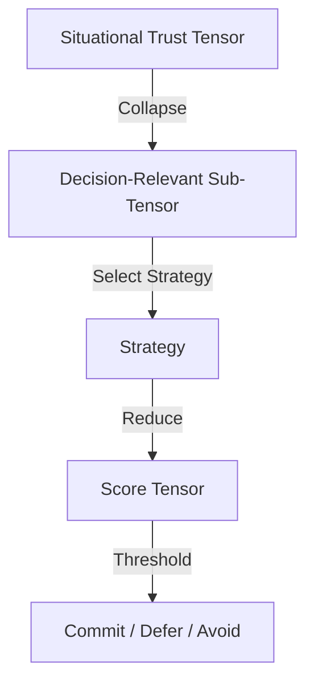

# Decision-Specific Trust Tensor Model for WEB4

## Overview

In WEB4's **coherence engine**, trust is not a single score but a **dynamic tensor**. This tensor captures multiple dimensions of trust, each relevant to different aspects of sensing, reasoning, and acting. The process of making a decision involves progressively focusing this tensor from the global context down to the immediate decision at hand.

## Process Flow

### 1. Situational Trust Tensor

- **Input:** All available trust dimensions across the system's Markov Relevancy Horizon (MRH).
- **Nature:** High-dimensional, containing contextual weights for sensory reliability, historical accuracy, environmental factors, and source credibility.
- **Purpose:** Represents *everything known* about trust at this moment.

```
Full Tensor (T_situational):
[ Sensor_1_trust, Sensor_2_trust, Historical_alignment, Source_reputation, Environmental_clarity, ... ]
```

### 2. Collapse to Decision-Relevant Sub-Tensor

- **Goal:** Remove irrelevant trust dimensions for the current decision.
- **Example:** For a mobile robot deciding to move through a doorway:
  - Keep: visual clarity, depth perception, obstacle detection.
  - Drop: long-term partner reliability, unrelated sensor channels.

```
T_decision = collapse(T_situational, relevance_criteria)
```

### 3. Strategy Selection

- **High Trust Sub-Tensor:** Commit to high-speed, long-range decisions.
- **Moderate Trust:** Use cautious, feedback-driven exploration.
- **Low Trust:** Switch to slow, probing, reversible actions.

```
strategy = select_strategy(T_decision)
```

### 4. Score Tensor Reduction

- **Purpose:** Derive a smaller, faster-to-evaluate representation.
- **May Remain Multi-Dimensional:** Allows for nuanced evaluation of risks and trade-offs.
- **Example:** In doorway scenario, depth\_accuracy and obstacle\_clearance might remain separate scores.

```
T_score = reduce(T_decision, strategy)
```

### 5. Commitment or Deferment

- **Thresholding:** Compare score tensor against contextual thresholds.
- **Action Outcomes:**
  - Commit.
  - Delay until more data arrives.
  - Avoid action entirely.

```
action = select_action(T_score, risk_profile)
```

## Embodiment Example

- **Binocular vision fully functional:** High-confidence depth perception → fast movement.
- **One eye obscured:** Depth accuracy reduced → switch to cautious probing.
- **Both eyes obscured:** No depth data → revert to tactile exploration.

## Fractal Application

This logic applies at all scales:

- **Physical Agents:** Movement and manipulation.
- **Distributed Systems:** Accepting or rejecting remote instructions.
- **Societal Level:** Adopting policies based on the trustworthiness of aggregated data.

## Why WEB4 Uses This Model

- **Avoids scalar oversimplification** that hides critical nuance.
- **Encodes proportional caution** based on data quality.
- **Supports adaptive decision-making** even under uncertainty.

---

**Diagram: Trust Tensor Flow**



