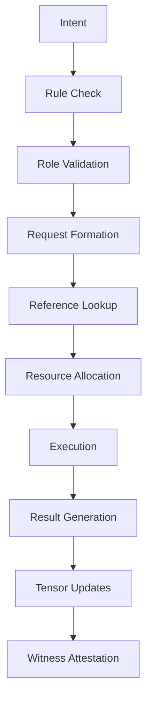

# R6 Framework and Tensor Systems Guide

## Overview

The R6 Action Framework and T3/V3 Tensor Systems work together to enable structured interactions with continuous learning and reputation evolution. Every action in Web4 can be expressed through R6, and every R6 action updates the participating entities' tensors.

## Part 1: R6 Action Framework

### Core Concept

R6 transforms intent into reality through six components:

```
Rules + Role + Request + Reference + Resource → Result
```

This creates a complete action lifecycle with built-in trust calculation, resource management, and outcome tracking.

### The Six Components

#### 1. Rules (What's Possible)
Define the constraints and possibilities for the action.

```json
{
  "rules": {
    "applicable": ["data_processing", "analysis", "reporting"],
    "constraints": {
      "max_atp": 100,
      "timeout_seconds": 3600,
      "quality_threshold": 0.85
    },
    "requirements": {
      "entity_type": ["human", "ai"],
      "min_t3": {
        "talent": 0.6,
        "training": 0.7,
        "temperament": 0.8
      }
    }
  }
}
```

#### 2. Role (Who Can Act)
Determines permissions and context for the action.

```json
{
  "role": {
    "lct": "lct:web4:role:data_analyst",
    "permissions": [
      "data:read",
      "compute:execute",
      "report:write"
    ],
    "delegation_from": "lct:web4:org:...",
    "valid_until": "2025-12-31T23:59:59Z"
  }
}
```

#### 3. Request (What's Wanted)
Expresses the intent and parameters of the action.

```json
{
  "request": {
    "intent": "analyze_user_behavior",
    "parameters": {
      "dataset": "lct:web4:resource:usage_logs",
      "timeframe": "last_30_days",
      "metrics": ["engagement", "retention", "conversion"],
      "output_format": "dashboard"
    },
    "priority": "normal",
    "requestor": "lct:web4:human:..."
  }
}
```

#### 4. Reference (Historical Context)
Provides context from similar past actions.

```json
{
  "reference": {
    "similar_actions": [
      {
        "action_id": "r6:web4:...",
        "similarity": 0.92,
        "outcome": "success",
        "atp_used": 45,
        "duration": 1200
      }
    ],
    "patterns": {
      "success_rate": 0.87,
      "average_atp": 50,
      "common_failures": ["timeout", "resource_limit"]
    },
    "confidence": 0.85
  }
}
```

#### 5. Resource (What's Needed)
Specifies computational and energetic requirements.

```json
{
  "resource": {
    "atp_required": 55,
    "compute_units": 1000,
    "memory_gb": 8,
    "storage_gb": 20,
    "network_bandwidth_mbps": 100,
    "estimated_duration": 1800
  }
}
```

#### 6. Result (What Happened)
Records the outcome and impacts.

```json
{
  "result": {
    "status": "success",
    "output": {
      "dashboard_url": "web4://dashboard/...",
      "insights_found": 7,
      "anomalies_detected": 2
    },
    "metrics": {
      "actual_atp": 52,
      "actual_duration": 1650,
      "quality_score": 0.91
    },
    "t3_updates": {
      "talent": 0.01,
      "training": 0.005,
      "temperament": 0.002
    },
    "v3_generated": {
      "valuation": 0.93,
      "veracity": 0.95,
      "validity": 1.0
    },
    "witnesses": ["lct:web4:oracle:..."]
  }
}
```

### R6 Action Lifecycle



### Confidence Calculation

Before execution, R6 calculates confidence:

```python
confidence = (
    w1 * t3_alignment +      # Actor's T3 fit for task
    w2 * historical_success + # Similar action success rate
    w3 * resource_availability + # Resource sufficiency
    w4 * role_match          # Role permission alignment
) / (w1 + w2 + w3 + w4)

# Threshold check
if confidence < 0.7:
    return "Low confidence - request review"
```

## Part 2: T3 Tensor System (Trust)

### Three Dimensions of Trust

#### Talent (Inherent Capability)
- **Definition**: Natural aptitude and creative problem-solving ability
- **Range**: 0.0 to 1.0
- **Stability**: High - represents inherent capability
- **Growth**: Slow, through novel achievements

#### Training (Acquired Expertise)
- **Definition**: Learned skills and domain knowledge
- **Range**: 0.0 to 1.0
- **Stability**: Medium - requires maintenance
- **Growth**: Steady, through practice and study

#### Temperament (Behavioral Reliability)
- **Definition**: Consistency, reliability, ethical behavior
- **Range**: 0.0 to 1.0
- **Stability**: High - but can drop quickly on violations
- **Growth**: Slow, through consistent performance

### T3 Evolution Mechanics

#### Performance-Based Updates

| Action Outcome | Talent Δ | Training Δ | Temperament Δ |
|---------------|----------|------------|---------------|
| **Novel Success** | +0.02 to +0.05 | +0.01 to +0.02 | +0.01 |
| **Standard Success** | 0 | +0.005 to +0.01 | +0.005 |
| **Learning Experience** | +0.01 | +0.02 | 0 |
| **Expected Failure** | -0.01 | 0 | 0 |
| **Unexpected Failure** | -0.02 | -0.01 | -0.02 |
| **Ethics Violation** | -0.05 | 0 | -0.10 |
| **Timeout/Abandon** | 0 | -0.005 | -0.01 |

#### Context-Specific Tracking

```json
{
  "t3_tensor": {
    "global": {
      "talent": 0.75,
      "training": 0.82,
      "temperament": 0.91
    },
    "by_domain": {
      "data_analysis": {
        "talent": 0.85,
        "training": 0.90,
        "temperament": 0.95,
        "action_count": 145,
        "last_update": "2025-01-11T15:00:00Z"
      },
      "content_creation": {
        "talent": 0.65,
        "training": 0.70,
        "temperament": 0.91,
        "action_count": 23,
        "last_update": "2025-01-10T12:00:00Z"
      }
    }
  }
}
```

### T3 Decay and Maintenance

```python
# Monthly decay calculation
def calculate_t3_decay(last_action_date, current_date):
    months_inactive = (current_date - last_action_date).days / 30
    
    training_decay = min(0.001 * months_inactive, 0.1)  # Max 10% decay
    temperament_recovery = min(0.01 * months_inactive, 0.05)  # Max 5% recovery
    
    return {
        "talent": 0,  # No decay - inherent capability
        "training": -training_decay,
        "temperament": temperament_recovery if bad_history else 0
    }
```

## Part 3: V3 Tensor System (Value)

### Three Dimensions of Value

#### Valuation (Subjective Worth)
- **Definition**: Perceived value by recipients
- **Range**: Variable (can exceed 1.0)
- **Measurement**: Recipient satisfaction × market rate
- **Aggregation**: Weighted by recency and significance

#### Veracity (Objective Accuracy)
- **Definition**: Truthfulness and accuracy of outputs
- **Range**: 0.0 to 1.0
- **Measurement**: Verified claims / total claims
- **Validation**: External witness attestation

#### Validity (Confirmed Transfer)
- **Definition**: Successful value delivery
- **Range**: 0.0 to 1.0 (binary per transaction)
- **Measurement**: 1.0 if delivered, 0.0 if failed
- **Aggregation**: Success rate over time

### V3 Calculation Methods

#### Per-Action Calculation

```python
def calculate_v3(action_result):
    # Valuation: How much value was created vs expected
    valuation = (
        action_result.atp_earned / action_result.atp_expected *
        action_result.recipient_satisfaction
    )
    
    # Veracity: How accurate were the results
    veracity = (
        action_result.verified_outputs / action_result.total_outputs *
        action_result.witness_confidence
    )
    
    # Validity: Was value successfully delivered
    validity = 1.0 if action_result.delivered else 0.0
    
    return {
        "valuation": valuation,
        "veracity": veracity,
        "validity": validity,
        "atp_generated": action_result.atp_earned
    }
```

#### Aggregate Tracking

```json
{
  "v3_tensor": {
    "lifetime": {
      "total_value_created_atp": 45670,
      "transaction_count": 523,
      "average_valuation": 0.89,
      "veracity_score": 0.94,
      "validity_rate": 0.97
    },
    "recent_30d": {
      "value_created_atp": 3420,
      "transaction_count": 45,
      "average_valuation": 0.91,
      "veracity_score": 0.95,
      "validity_rate": 0.98
    },
    "by_context": {
      "data_processing": {
        "average_valuation": 0.93,
        "veracity": 0.96,
        "validity": 0.99
      }
    }
  }
}
```

## Part 4: Tensor Interactions

### T3 → V3 Influence

How trust dimensions affect value creation:

```python
def predict_v3_from_t3(t3_scores, task_requirements):
    # High talent enables innovative solutions (higher valuation)
    valuation_boost = t3_scores.talent * 0.2
    
    # High training ensures accuracy (higher veracity)
    veracity_base = 0.5 + (t3_scores.training * 0.5)
    
    # High temperament ensures delivery (higher validity)
    validity_probability = 0.7 + (t3_scores.temperament * 0.3)
    
    return {
        "expected_valuation": 0.8 + valuation_boost,
        "expected_veracity": veracity_base,
        "expected_validity": validity_probability
    }
```

### V3 → T3 Feedback

How value outcomes update trust:

```python
def update_t3_from_v3(current_t3, v3_result):
    updates = {}
    
    # Exceptional valuation indicates talent
    if v3_result.valuation > 1.2:
        updates["talent"] = 0.02
    
    # High veracity validates training
    if v3_result.veracity > 0.95:
        updates["training"] = 0.01
    
    # Perfect validity reinforces temperament
    if v3_result.validity == 1.0:
        updates["temperament"] = 0.005
    
    # Poor performance decreases scores
    if v3_result.valuation < 0.5:
        updates["talent"] = -0.01
    if v3_result.veracity < 0.7:
        updates["training"] = -0.01
    if v3_result.validity < 1.0:
        updates["temperament"] = -0.02
    
    return updates
```

## Part 5: Practical Applications

### Role Matching with Tensors

```python
def match_entity_to_role(entity_t3, role_requirements):
    # Calculate dimension matches
    talent_match = entity_t3.talent >= role_requirements.min_talent
    training_match = entity_t3.training >= role_requirements.min_training
    temperament_match = entity_t3.temperament >= role_requirements.min_temperament
    
    # Weight by role priorities
    score = (
        role_requirements.talent_weight * entity_t3.talent +
        role_requirements.training_weight * entity_t3.training +
        role_requirements.temperament_weight * entity_t3.temperament
    )
    
    return {
        "qualified": all([talent_match, training_match, temperament_match]),
        "match_score": score,
        "gaps": identify_gaps(entity_t3, role_requirements)
    }
```

### ATP Pricing with Tensors

```python
def calculate_atp_price(base_cost, provider_tensors, complexity):
    # Higher T3 commands premium
    t3_multiplier = 1 + (
        (provider_tensors.t3.global.talent * 0.3) +
        (provider_tensors.t3.global.training * 0.2) +
        (provider_tensors.t3.global.temperament * 0.1)
    )
    
    # Historical V3 affects pricing
    v3_multiplier = provider_tensors.v3.average_valuation
    
    # Complexity adjustment
    complexity_multiplier = 1 + (complexity * 0.5)
    
    return base_cost * t3_multiplier * v3_multiplier * complexity_multiplier
```

### Team Composition Optimization

```python
def optimize_team_composition(available_entities, task_requirements):
    team = []
    
    # Identify needed capabilities
    for capability in task_requirements.capabilities:
        # Find best entity for each capability
        best_entity = max(
            available_entities,
            key=lambda e: e.t3.contextual[capability].weighted_score()
        )
        team.append({
            "entity": best_entity,
            "role": capability,
            "confidence": calculate_confidence(best_entity, capability)
        })
    
    # Calculate team synergy
    team_t3 = aggregate_team_tensors(team)
    expected_v3 = predict_team_performance(team_t3)
    
    return {
        "team": team,
        "combined_t3": team_t3,
        "expected_v3": expected_v3,
        "success_probability": calculate_success_probability(team_t3, task_requirements)
    }
```

## Part 6: Implementation Guidelines

### Tensor Storage

```sql
-- T3 Tensor Table
CREATE TABLE t3_tensors (
    lct_id VARCHAR(64) PRIMARY KEY,
    global_talent DECIMAL(4,3),
    global_training DECIMAL(4,3),
    global_temperament DECIMAL(4,3),
    last_update TIMESTAMP,
    update_count INTEGER
);

-- Contextual T3 Scores
CREATE TABLE t3_contextual (
    lct_id VARCHAR(64),
    context VARCHAR(128),
    talent DECIMAL(4,3),
    training DECIMAL(4,3),
    temperament DECIMAL(4,3),
    action_count INTEGER,
    last_action TIMESTAMP,
    PRIMARY KEY (lct_id, context)
);

-- V3 History
CREATE TABLE v3_history (
    action_id VARCHAR(64) PRIMARY KEY,
    lct_id VARCHAR(64),
    valuation DECIMAL(5,3),
    veracity DECIMAL(4,3),
    validity DECIMAL(1,0),
    atp_generated INTEGER,
    timestamp TIMESTAMP
);
```

### Update Triggers

```python
class TensorManager:
    def on_r6_complete(self, action_result):
        # Update performer's tensors
        performer_updates = self.calculate_tensor_updates(action_result)
        self.apply_t3_updates(action_result.performer, performer_updates.t3)
        self.record_v3_outcome(action_result.performer, performer_updates.v3)
        
        # Update role's tensors if applicable
        if action_result.role:
            self.update_role_history(action_result.role, performer_updates)
        
        # Notify witnesses for attestation
        for witness in action_result.witnesses:
            self.request_attestation(witness, action_result)
        
        # Trigger dependent updates
        self.update_mrh_relationships(action_result.performer)
        self.recalculate_reputation(action_result.performer)
```

### Privacy Considerations

```python
class TensorPrivacy:
    def get_visible_tensors(self, requester, target):
        relationship = self.get_relationship(requester, target)
        
        if relationship in ["bound", "paired"]:
            # Full visibility for close relationships
            return self.get_full_tensors(target)
        
        elif relationship == "witnessing":
            # Contextual visibility for witnesses
            return self.get_contextual_tensors(target, requester.witness_context)
        
        else:
            # Public visibility only
            return {
                "t3": self.get_public_t3(target),  # Global scores only
                "v3": self.get_public_v3(target)   # Aggregate only
            }
```

## Part 7: Advanced Patterns

### Tensor Prediction

```python
def predict_tensor_evolution(entity, planned_actions):
    current_t3 = entity.t3_tensor.copy()
    current_v3 = entity.v3_tensor.copy()
    
    for action in planned_actions:
        # Predict success probability
        success_prob = calculate_success_probability(current_t3, action)
        
        # Model expected updates
        if random.random() < success_prob:
            t3_delta = calculate_success_impact(action, current_t3)
            v3_outcome = calculate_expected_v3(action, current_t3)
        else:
            t3_delta = calculate_failure_impact(action, current_t3)
            v3_outcome = {"valuation": 0, "veracity": 0, "validity": 0}
        
        # Apply changes
        current_t3 = apply_updates(current_t3, t3_delta)
        current_v3 = aggregate_v3(current_v3, v3_outcome)
    
    return {
        "predicted_t3": current_t3,
        "predicted_v3": current_v3,
        "improvement_path": optimize_action_sequence(planned_actions)
    }
```

### Cross-Entity Tensor Correlation

```python
def analyze_tensor_correlations(entity_group):
    correlations = {}
    
    for entity_a, entity_b in combinations(entity_group, 2):
        # Check if entities interact
        if has_relationship(entity_a, entity_b):
            # Calculate tensor similarity
            t3_similarity = cosine_similarity(
                entity_a.t3_tensor.vector(),
                entity_b.t3_tensor.vector()
            )
            
            # Analyze value exchange
            value_flow = calculate_value_flow(entity_a, entity_b)
            
            correlations[(entity_a, entity_b)] = {
                "t3_similarity": t3_similarity,
                "value_exchange": value_flow,
                "synergy_score": t3_similarity * value_flow
            }
    
    return correlations
```

## Common Pitfalls and Solutions

### Pitfall 1: Gaming the System
**Problem**: Entities repeatedly performing easy tasks to boost scores
**Solution**: Exponential decay on repeated similar actions

### Pitfall 2: Context Confusion
**Problem**: Global scores don't reflect domain-specific capabilities
**Solution**: Always check contextual scores for specific tasks

### Pitfall 3: Tensor Drift
**Problem**: Scores become stale without recent activity
**Solution**: Implement decay mechanics and require periodic refresh

### Pitfall 4: Over-Reliance on Historical Data
**Problem**: Past performance doesn't guarantee future results
**Solution**: Weight recent actions more heavily, consider context changes

### Pitfall 5: Witness Collusion
**Problem**: Entities collude to inflate each other's scores
**Solution**: Require witness diversity, detect unusual patterns

## Conclusion

The R6 Framework and T3/V3 Tensors create a self-reinforcing system where:
- Every action has structure (R6)
- Every entity builds reputation (T3)
- Every contribution creates value (V3)
- Trust and value evolve through genuine interaction

This creates a trust-native environment where reputation is earned, value flows to genuine contribution, and both humans and AI can collaborate as trusted peers.