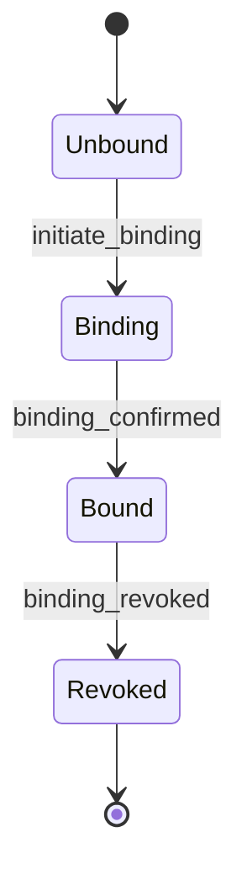
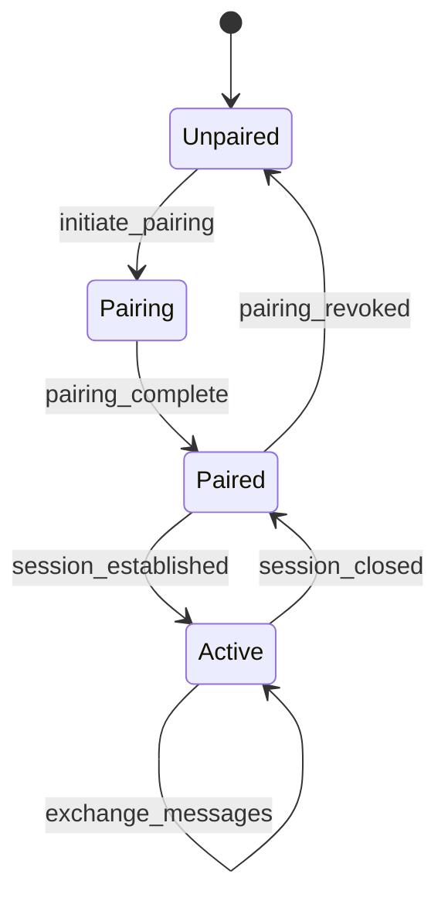
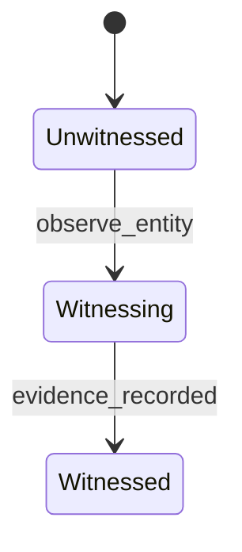
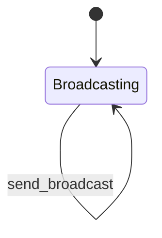

# Web4 Entity Relationship Mechanisms

This document provides the formal specifications for the four core entity relationship mechanisms in Web4: BINDING, PAIRING, WITNESSING, and BROADCAST. These mechanisms are the foundation of Web4's unique approach to building trust and enabling secure, decentralized interactions.


## 1. BINDING (Permanent Identity Attachment)

BINDING is the process of creating a permanent, unforgeable link between a Web4 entity and its digital identity, represented by a Lineage and Capability Token (LCT). This is the foundational act of creating a new Web4 entity.

### 1.1. ABNF Specification

```abnf
binding-request = binding-version SP entity-type SP public-key SP hardware-id
binding-response = binding-version SP lct-id SP binding-proof
binding-version = "BIND/1.0"
entity-type = "DEVICE" / "SERVICE" / "USER" / "ORACLE"
hardware-id = 64*64HEXDIG  ; SHA-256 of hardware characteristics
binding-proof = signature over (entity-type / public-key / hardware-id / timestamp)
```

### 1.2. State Machine




## 2. PAIRING (Authorized Operational Relationships)

PAIRING is the process of establishing an authorized, operational relationship between two already-bound Web4 entities. This allows them to communicate securely and perform actions based on a mutually agreed-upon context and set of rules.

### 2.1. ABNF Specification

```abnf
pairing-request = pairing-version SP lct-a SP lct-b SP context SP rules
pairing-response = pairing-version SP session-id SP key-half-a SP key-half-b
pairing-version = "PAIR/1.0"
context = quoted-string  ; "energy-management", "data-exchange", etc.
rules = "{" rule-list "}"
key-half-a = base64(32-bytes)  ; For symmetric key derivation
key-half-b = base64(32-bytes)
```

### 2.2. State Machine




## 3. WITNESSING (Trust Building Through Observation)

WITNESSING is the process by which a Web4 entity observes and attests to the existence, actions, or state of another entity. This creates a verifiable record of interactions that builds trust over time and makes entities unforgeable through accumulated observation.

### 3.1. ABNF Specification

```abnf
witness-assertion = witness-version SP observer-lct SP observed-lct SP evidence
witness-version = "WTNS/1.0"
evidence = evidence-type SP evidence-data SP signature
evidence-type = "EXISTENCE" / "ACTION" / "STATE" / "TRANSITION"
; Creates bidirectional MRH tensor links
```

### 3.2. State Machine




## 4. BROADCAST (Unidirectional Discovery)

BROADCAST is a simple, unidirectional mechanism for an entity to announce its presence, capabilities, or status without requiring any prior relationship or acknowledgment. This is used for discovery and general network awareness.

### 4.1. ABNF Specification

```abnf
broadcast-message = broadcast-version SP sender-id SP message-type SP payload
broadcast-version = "CAST/1.0"
sender-id = entity-type ":" local-identifier
message-type = "ANNOUNCE" / "HEARTBEAT" / "CAPABILITY"
; No acknowledgment required, no relationship formed
```

### 4.2. State Machine




