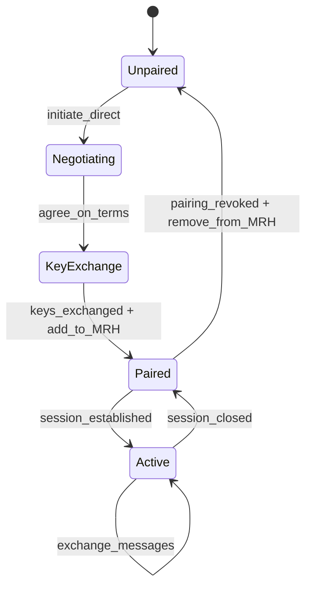
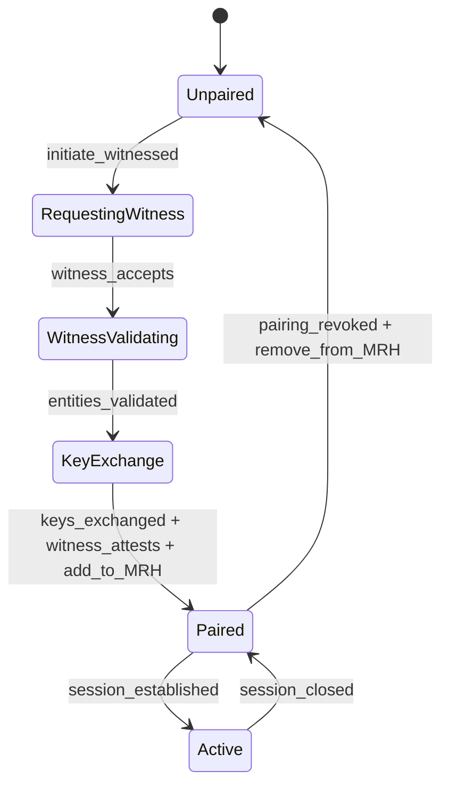
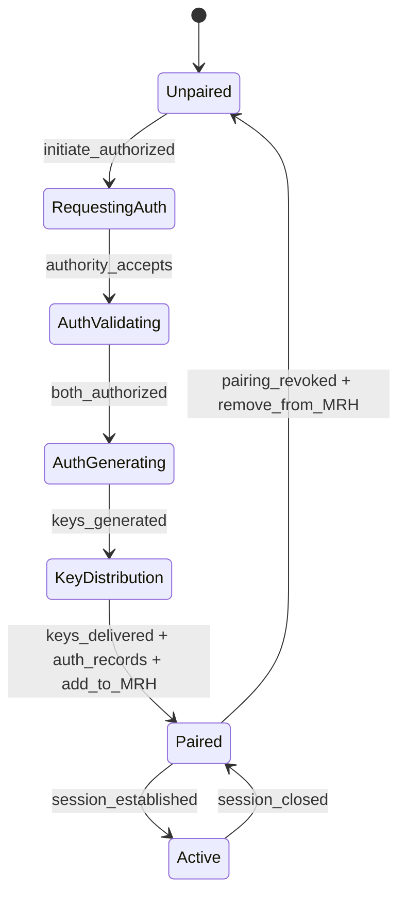

# Web4 Entity Relationship Mechanisms

This document provides the formal specifications for the four core entity relationship mechanisms in Web4: BINDING, PAIRING, WITNESSING, and BROADCAST. These mechanisms are the foundation of Web4's unique approach to building trust and enabling secure, decentralized interactions.

## Interaction Framework: R6 Actions

While these four mechanisms establish relationships, actual interactions between entities are structured through the R6 Action Framework. Every meaningful interaction can be expressed as an R6 action that:
- Tracks intent through Request
- Validates permissions through Role
- Consumes Resources (ATP)
- Produces measurable Results
- Updates T3/V3 tensors based on performance
- Creates References for future learning

See `web4-r6-framework.md` for complete R6 specification.


## 1. BINDING (Permanent Identity Attachment)

BINDING is the process of creating a permanent, unforgeable link between a Web4 entity and its digital identity, represented by a Lineage and Capability Token (LCT). This is the foundational act of creating a new Web4 entity.

### 1.1. ABNF Specification

```abnf
binding-request = binding-version SP entity-type SP public-key SP hardware-id
binding-response = binding-version SP lct-id SP binding-proof
binding-version = "BIND/1.0"
entity-type = "HUMAN" / "AI" / "ORGANIZATION" / "ROLE" / "TASK" / "RESOURCE" / "DEVICE" / "SERVICE" / "ORACLE" / "ACCUMULATOR" / "DICTIONARY" / "HYBRID"
hardware-id = 64*64HEXDIG  ; SHA-256 of hardware characteristics
binding-proof = signature over (entity-type / public-key / hardware-id / timestamp)
```

### 1.2. State Machine


### 1.3. MRH Impact

When a BINDING is established:
1. Parent LCT adds child to its `mrh.bound` array with type="child"
2. Child LCT adds parent to its `mrh.bound` array with type="parent"
3. Both LCTs update `mrh.last_updated` timestamp
4. Trust context begins flowing between bound entities


## 2. PAIRING (Authorized Operational Relationships)

PAIRING is the process of establishing an authorized, operational relationship between two already-bound Web4 entities. This allows them to communicate securely and perform actions based on a mutually agreed-upon context and set of rules.

### Pairing Modes

Web4 supports three distinct pairing modes to accommodate different trust and operational requirements:

#### 2.0.1 Direct Pairing (Peer-to-Peer)
- Entities negotiate pairing directly
- Each entity generates half of the session key
- No third-party involvement
- Lowest latency, highest privacy
- Trust based solely on entity reputations

#### 2.0.2 Witnessed Pairing (Notarized)
- Third entity observes and attests to pairing
- Witness validates both entities' identities
- Creates permanent record of pairing establishment
- Similar to notary public in legal contexts
- Adds trust through external validation

#### 2.0.3 Authorized Pairing (Mediated)
- Third entity (authority) handles entire pairing process
- Authority validates both entities' authorization
- Authority generates complete key set
- Authority delivers key halves to respective entities
- Authority maintains pairing record
- Highest trust, enables policy enforcement

### Special Case: Role-Agent Pairing

When an agentic entity (human or AI) pairs with a role entity, the pairing creates a delegation relationship where:
- The agent temporarily assumes the role's permissions and responsibilities
- Actions taken by the agent are contextualized by the role's scope
- Performance metrics accumulate to both the agent's and role's reputation
- The role maintains a history of all agents who have performed it

### 2.1. ABNF Specification

```abnf
; Common elements
pairing-version = "PAIR/1.0"
context = quoted-string  ; "energy-management", "data-exchange", etc.
rules = "{" rule-list "}"

; Direct pairing (peer-to-peer)
direct-pairing-request = pairing-version SP "DIRECT" SP lct-a SP lct-b SP context SP rules
direct-pairing-response = pairing-version SP session-id SP key-half-a SP key-half-b

; Witnessed pairing (with notary)
witnessed-pairing-request = pairing-version SP "WITNESSED" SP lct-a SP lct-b SP witness-lct SP context SP rules
witnessed-pairing-response = pairing-version SP session-id SP key-half-a SP key-half-b SP witness-attestation

; Authorized pairing (mediated by authority)
authorized-pairing-request = pairing-version SP "AUTHORIZED" SP lct-a SP lct-b SP authority-lct SP context SP rules
authorized-pairing-response = pairing-version SP session-id SP encrypted-key-a SP encrypted-key-b SP authority-record

; Key material
key-half-a = base64(32-bytes)  ; For symmetric key derivation
key-half-b = base64(32-bytes)
encrypted-key-a = base64(encrypted(full-key))  ; Encrypted for entity A
encrypted-key-b = base64(encrypted(full-key))  ; Encrypted for entity B
witness-attestation = signature over (lct-a / lct-b / session-id / timestamp)
authority-record = signature over (pairing-details / authorization-proof)
```

### 2.2. State Machines by Mode

#### Direct Pairing State Machine


#### Witnessed Pairing State Machine


#### Authorized Pairing State Machine


### 2.3. MRH Impact by Pairing Mode

#### Direct Pairing MRH Updates
When a DIRECT PAIRING is established:
1. Both LCTs add each other to their `mrh.paired` arrays
2. Include pairing context and session_id
3. Mark pairing_mode as "direct"
4. Update `mrh.last_updated` on both LCTs

#### Witnessed Pairing MRH Updates
When a WITNESSED PAIRING is established:
1. Both LCTs add each other to their `mrh.paired` arrays
2. Both LCTs add witness to their `mrh.witnessing` arrays
3. Witness LCT records pairing attestation
4. Include pairing context, session_id, and witness_lct
5. Mark pairing_mode as "witnessed"
6. Update `mrh.last_updated` on all three LCTs

#### Authorized Pairing MRH Updates
When an AUTHORIZED PAIRING is established:
1. Both LCTs add each other to their `mrh.paired` arrays
2. Both LCTs add authority to their `mrh.witnessing` arrays
3. Authority LCT maintains pairing record in its state
4. Include pairing context, session_id, and authority_lct
5. Mark pairing_mode as "authorized"
6. Update `mrh.last_updated` on all three LCTs

#### Role-Agent Pairing Specifics
For Role-Agent pairings (any mode):
1. Role LCT adds agent to its current performers list
2. Agent LCT adds role to its active roles
3. Role's permission set becomes available to agent
4. Performance tracking begins for reputation calculation
5. Authority mode recommended for high-stakes roles

### 2.4. Pairing Mode Selection Criteria

#### When to Use Direct Pairing
- Both entities have established reputations
- Low-risk interactions
- Privacy is paramount
- Latency must be minimized
- No regulatory requirements

#### When to Use Witnessed Pairing
- Moderate-risk interactions
- Legal or compliance requirements
- Need for dispute resolution
- Building trust history
- Cross-domain operations

#### When to Use Authorized Pairing
- High-risk or high-value interactions
- Regulatory compliance mandatory
- Policy enforcement required
- Complex authorization rules
- Enterprise or institutional contexts
- Role assignments with significant permissions

### 2.5. Implementation Examples

#### Direct Pairing Example
```json
{
  "pairing_request": {
    "version": "PAIR/1.0",
    "mode": "DIRECT",
    "entity_a": "lct:web4:human:alice",
    "entity_b": "lct:web4:ai:assistant",
    "context": "collaborative_writing",
    "rules": {
      "duration": 3600,
      "permissions": ["read", "suggest"]
    }
  }
}
```

#### Witnessed Pairing Example
```json
{
  "pairing_request": {
    "version": "PAIR/1.0",
    "mode": "WITNESSED",
    "entity_a": "lct:web4:org:company",
    "entity_b": "lct:web4:service:provider",
    "witness": "lct:web4:oracle:notary",
    "context": "service_agreement",
    "rules": {
      "sla": "99.9% uptime",
      "term": "annual"
    }
  }
}
```

#### Authorized Pairing Example
```json
{
  "pairing_request": {
    "version": "PAIR/1.0",
    "mode": "AUTHORIZED",
    "entity_a": "lct:web4:human:employee",
    "entity_b": "lct:web4:role:financial_officer",
    "authority": "lct:web4:org:hr_department",
    "context": "role_assignment",
    "rules": {
      "clearance_level": "executive",
      "permissions": ["approve:budgets", "sign:contracts"],
      "audit_required": true
    }
  }
}
```

### 2.6. R6 Integration with Pairing

Once paired (regardless of mode), entities interact through R6 actions:
- The pairing context defines available Rules
- The Role from pairing determines permissions
- Shared Resources become accessible
- Results affect both entities' T3/V3 tensors
- Failed actions may trigger pairing review
- Witnessed/Authorized pairings provide stronger confidence scores


## 3. WITNESSING (Trust Building Through Observation)

WITNESSING is the process by which a Web4 entity observes and attests to the existence, actions, or state of another entity. This creates a verifiable record of interactions that builds trust over time and makes entities unforgeable through accumulated observation.

### 3.1. ABNF Specification

```abnf
witness-assertion = witness-version SP observer-lct SP observed-lct SP evidence
witness-version = "WTNS/1.0"
evidence = evidence-type SP evidence-data SP signature
evidence-type = "EXISTENCE" / "ACTION" / "STATE" / "TRANSITION"
; Creates bidirectional MRH tensor links
```

### 3.2. State Machine


### 3.3. MRH Impact

When WITNESSING occurs:
1. Witnessed LCT adds witness to its `mrh.witnessing` array
2. Witness LCT may optionally track witnessed entities
3. Both update `mrh.last_updated`
4. Creates bidirectional awareness in relevancy horizons
5. Trust accumulates through repeated witnessing interactions

### 3.4. R6 Integration with Witnessing

Witnesses play a crucial role in R6 actions:
- Witnesses validate Result accuracy (affecting Veracity in V3)
- Quality witnesses assess output value (affecting Valuation)
- Time witnesses provide temporal ordering
- Failed witness validation can void Results
- Witness attestations become permanent References


## 4. BROADCAST (Unidirectional Discovery and Passive Witnessing)

BROADCAST is a unidirectional mechanism for an entity to announce its presence, capabilities, or status without requiring any prior relationship or acknowledgment. This is used for discovery, general network awareness, and enables a one-sided form of witnessing through accumulators.

### 4.1. ABNF Specification

```abnf
broadcast-message = broadcast-version SP sender-id SP message-type SP payload
broadcast-version = "CAST/1.0"
sender-id = entity-type ":" local-identifier
message-type = "ANNOUNCE" / "HEARTBEAT" / "CAPABILITY"
; No acknowledgment required, no relationship formed
```

### 4.2. State Machine


### 4.3. MRH Impact

BROADCAST is unique - it does NOT update MRH:
1. Broadcasting entity announces without creating relationships
2. Receiving entities MAY choose to initiate pairing based on broadcast
3. No MRH entries created until explicit relationship established
4. Enables discovery without commitment to relevancy horizon

### 4.4. Broadcast Accumulators

BROADCAST enables a one-sided form of witnessing through accumulators:

#### Accumulator Function
Accumulators are specialized entities that:
1. **Listen** for broadcasts without acknowledgment
2. **Record** broadcast history with timestamps and cryptographic proofs
3. **Index** broadcasts by entity, type, and time
4. **Respond** to queries about broadcast history

#### Lightweight Presence Validation
```abnf
accumulator-query = query-version SP entity-lct SP time-range
accumulator-response = query-version SP broadcast-count SP broadcast-history
broadcast-history = 1*(timestamp SP broadcast-hash SP signature)
```

#### Use Cases
- **Presence Proof**: Entity can query accumulators to prove consistent broadcasting
- **Liveness Validation**: Third parties can verify entity has been active
- **Historical Audit**: Broadcast patterns reveal operational consistency
- **Reputation Building**: Regular broadcasts accumulate as soft trust signal

#### Privacy Considerations
- Accumulators record public broadcasts only
- Broadcasters cannot control which accumulators listen
- Accumulator queries may be anonymous
- Broadcast content may be hashed rather than stored in full

This creates a lightweight, privacy-preserving mechanism for building presence reputation over time without requiring explicit relationships or mutual witnessing.


