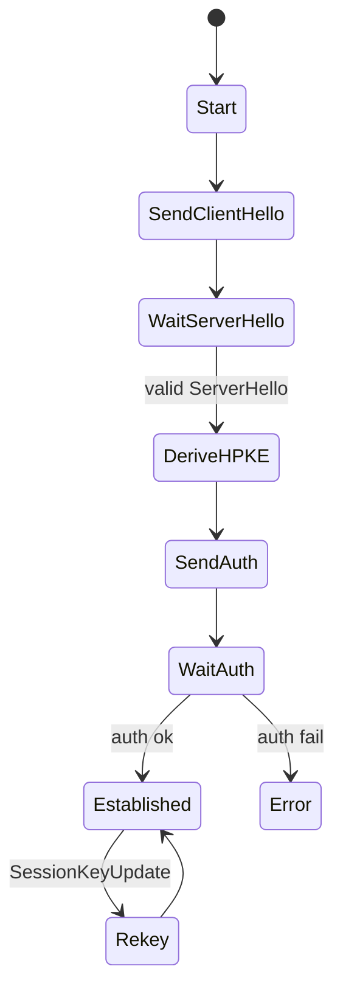

# Web4 Core Handshake (HPKE-based)
Status: Draft • Last-Updated: 2025-09-11T22:47:56.408268Z
Authors: Web4 Editors

## 1. Scope
This document specifies the mandatory-to-implement (MTI) handshake for Web4 endpoints.
It establishes an authenticated, forward-secret session using HPKE (RFC 9180) primitives,
with explicit capability negotiation, privacy-preserving pairwise identifiers (W4IDp),
and downgrade resistance.

## 2. Terminology
- MUST/SHOULD/MAY as per RFC 2119/8174.
- "Initiator" (I) and "Responder" (R) denote the two parties.
- Pairwise W4IDp: a pseudonymous identifier derived per peer to mitigate correlation.
- Suite: a named cryptographic parameter set.

## 3. Cryptographic Suites
At least the following suites MUST be implemented:

| Suite ID          | KEM     | SIG        | AEAD                | Hash    | Profile |
|-------------------|---------|------------|---------------------|---------|---------|
| W4-BASE-1 (MUST)  | X25519  | Ed25519    | ChaCha20-Poly1305   | SHA-256 | COSE    |
| W4-FIPS-1 (SHOULD)| P-256EC | ECDSA-P256 | AES-128-GCM         | SHA-256 | JOSE    |

HPKE KDF is HKDF-SHA-256. Implementations MAY offer additional suites but MUST apply
GREASE (random unknown suite IDs) during negotiation.

## 4. Identifiers

### 4.1 Pairwise W4IDp Derivation
Each party holds a *master secret* `sk_master` (32 bytes). A pairwise identifier for
peer P is derived:
```
w4idp = MB32(HKDF-Extract-Then-Expand(salt=peer_salt,
                                      IKM=sk_master,
                                      info="W4IDp:v1"))
```
Where MB32 is multibase base32 without padding.

### 4.2 Pairwise W4IDp Lifecycle

**Salt Requirements:**
- `peer_salt` MUST be 128-bit random, unique per counterparty relationship
- `peer_salt` MUST NOT be derived from stable identifiers
- `peer_salt` MUST be exchanged during initial handshake

**Lifetime and Rotation:**
- A W4IDp MUST be re-derived when either party rotates its master key
- W4IDp MUST NOT be reused across counterparties or exported into logs/URIs visible to unrelated parties
- Implementations SHOULD support at least 4 concurrently valid W4IDp values per peer to cover overlapping rotations

**Privacy Requirements:**
- W4IDp values MUST NOT contain or derive from personally identifiable information
- W4IDp MUST NOT be used as correlation handles across different relationships
- Implementations MUST generate new W4IDp for each relationship even with the same peer in different contexts


## 5. Capability & Suite Negotiation
The Initiator sends a `ClientHello` including supported suites, media profiles, and
extensions. Unknown extensions MUST be ignored. At least one GREASE extension MUST be sent.

### 5.0 GREASE Procedure

GREASE (Generate Random Extensions And Sustain Extensibility) prevents ossification:

**Extension ID Format:**
- GREASE extension IDs use format: `w4_ext_[8-hex-digits]@0`
- Reserved hex patterns: `*a*a*a*a` where `*` is any hex digit
- Example: `w4_ext_1a2a3a4a@0`, `w4_ext_fafbfcfd@0`

**Requirements:**
- Implementations MUST include at least one GREASE extension in ClientHello
- Implementations MUST ignore unrecognized extensions (including GREASE)
- GREASE values MUST be randomly generated for each handshake
- Suite IDs follow similar pattern: `W4-GREASE-[8-hex-digits]`

### 5.1 ClientHello (plaintext JSON, over TLS/QUIC or out-of-band)
```json
{
  "type": "ClientHello",
  "ver": "w4/1",
  "w4idp_hint": "w4idp-<base32>",
  "suites": ["W4-BASE-1", "W4-FIPS-1", "W4-GREASE-93f07f2a"],
  "media": ["application/web4+cbor", "application/web4+json"],
  "ext": ["w4_ext_sdjwt_vp@1", "w4_ext_noise_xx@1", "w4_ext_93f07f2a@0"],
  "nonce": "<random 96-bit>",
  "ts": "<iso8601>",
  "kex_epk": "<KEM public key (HPKE)>"
}
```

### 5.2 ServerHello
```json
{
  "type": "ServerHello",
  "ver": "w4/1",
  "w4idp": "w4idp-<base32>",
  "suite": "W4-BASE-1",
  "media": "application/web4+cbor",
  "ext_ack": ["w4_ext_sdjwt_vp@1"],
  "nonce": "<random 96-bit>",
  "ts": "<iso8601>",
  "kex_epk": "<KEM public key (HPKE)>"
}
```

The transcript hash `TH` is the running hash (SHA-256) over canonical encodings of
`ClientHello` and `ServerHello` messages using JCS (JSON) or CTAP2/COSE canonical CBOR.

## 6. Authentication & Key Confirmation
After Hello messages and HPKE context establishment, parties authenticate and bind
their identities and capabilities to the transcript using signatures.

### 6.0 Canonicalization and Signatures

Web4 defines two canonicalization and signature profiles:

#### COSE/CBOR (MUST)
- Deterministic CBOR encoding per CTAP2
- Ed25519 with `crv: Ed25519` and `alg: EdDSA`
- Payload is the canonical CBOR map

#### JOSE/JSON (SHOULD)
- JCS canonical JSON (RFC 8785)
- ES256 with compact serialization or JWS JSON serialization

### 6.1 HandshakeAuth (I → R, then R → I)
```
ciphertext = AEAD-Encrypt(context_key,
  {
    "type": "HandshakeAuth",
    "suite": "<chosen>",
    "kid": "<key id>",
    "alg": "<sig alg>",
    "sig": Sign(sk_sig, Hash(TH || channel_binding)),
    "cap": { "scopes": ["read:lct", "write:lct"], "ext": [...] },
    "nonce": "<random 96-bit>",
    "ts": "<iso8601>"
  })
```
- `channel_binding` MUST include both HPKE ephemeral keys.
- Receivers MUST verify `sig` against `kid`, reject on failure, and check freshness.

### 6.2 Session Keys
Both sides derive:
```
k_send, k_recv = HKDF-Expand(Secret=HPKE-exporter,
                             info="W4-SessionKeys:v1",
                             L=2*keylen)
```
Keys MUST be independent for each direction.

## 7. Rekey & Rotation
A `SessionKeyUpdate` message MAY be sent at any time, protected under current keys and
authenticated with the same `kid`. On receipt, the peer MUST perform a one-way ratchet
and discard old keys after a grace window.

## 8. State Machines

Responder mirrors the flow starting at `WaitClientHello`.

## 9. Anti-Replay & Clocks
- `nonce` values MUST be unique per key; maintain a replay window.
- Accept `ts` within ±300s; outside requires additional proof (e.g., witness timestamp).

## 10. Error Handling (Problem Details, RFC 9457)
Example (unauthorized):
```json
{
  "type": "about:blank",
  "title": "Unauthorized",
  "status": 401,
  "code": "W4_ERR_AUTHZ_DENIED",
  "detail": "Credential lacks scope write:lct",
  "instance": "web4://w4idp-ABCD/messages/123"
}
```

## 11. Security Considerations
- Forward secrecy via HPKE ephemeral keys.
- Downgrade resistance: include the selected suite and all proposals in `TH`.
- KCI resistance: do not reuse static DH for auth; signatures bind to `TH`.
- Privacy: pairwise W4IDp and GREASE to reduce linkability.
- Denial of Service: perform cheap checks (syntax, version) before KEM decap.

## 12. Interop Profiles
- **COSE/CBOR (MTI)**: Ed25519/X25519 + ChaCha20-Poly1305
- **JOSE/JSON (SHOULD)**: ECDSA-P256 + AES-128-GCM

## 13. Registries
- Suite IDs, Extension IDs, Error Codes (see registries/initial-registries.md)
