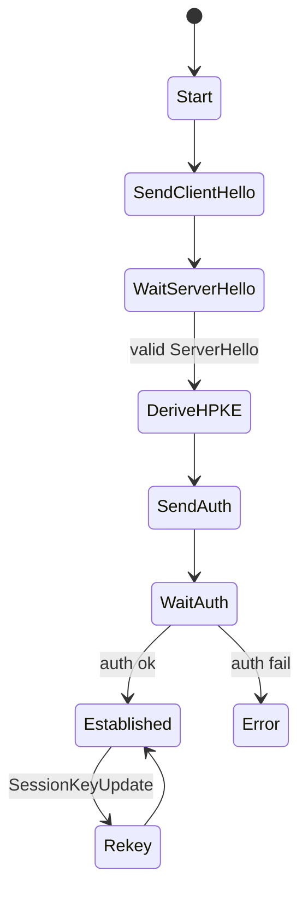

# Web4 Core Handshake (HPKE-based)
Status: Draft • Last-Updated: 2026-06-29T00:00:00Z
Authors: Web4 Editors

## 1. Scope
This document specifies the mandatory-to-implement (MTI) handshake for Web4 endpoints.
It establishes an authenticated, forward-secret session using HPKE (RFC 9180) primitives,
with explicit capability negotiation, privacy-preserving pairwise identifiers (W4IDp),
and downgrade resistance.

## 2. Terminology
- MUST/SHOULD/MAY as per RFC 2119/8174.
- "Initiator" (I) and "Responder" (R) denote the two parties.
- Pairwise W4IDp: a pseudonymous identifier derived per peer to mitigate correlation.
- Suite: a named cryptographic parameter set.

## 3. Cryptographic Suites
At least the following suites MUST be implemented:

| Suite ID          | KEM     | SIG        | AEAD                | Hash    | Profile |
|-------------------|---------|------------|---------------------|---------|---------|
| W4-BASE-1 (MUST)  | X25519  | Ed25519    | ChaCha20-Poly1305   | SHA-256 | COSE    |
| W4-FIPS-1 (SHOULD)| P-256EC | ECDSA-P256 | AES-128-GCM         | SHA-256 | JOSE    |
| W4-IOT-1 (MAY)    | X25519  | Ed25519    | AES-CCM             | SHA-256 | COSE    |

HPKE KDF is HKDF-SHA-256. Implementations MAY offer additional suites but MUST apply
GREASE (random unknown suite IDs) during negotiation.

## 4. Identifiers

### 4.1 Pairwise W4IDp Derivation
Each party holds a *master secret* `sk_master` (32 bytes). A pairwise identifier for
peer P is derived:
```
w4idp = MB32(HKDF-Extract-Then-Expand(salt=peer_salt,
                                      IKM=sk_master,
                                      info="W4IDp:v1",
                                      L=16))
```
Where MB32 is multibase base32 without padding and `L=16` is the HKDF-Expand
output length in bytes (matching the 16-byte truncation in `core-spec/data-formats.md`
§4.1), so that two conformant implementations derive identical-length identifiers.

### 4.2 Pairwise W4IDp Lifecycle

**Salt Requirements:**
- `peer_salt` MUST be 128-bit random, unique per counterparty relationship
- `peer_salt` MUST NOT be derived from stable identifiers
- `peer_salt` MUST be exchanged during initial handshake

**Lifetime and Rotation:**
- A W4IDp MUST be re-derived when either party rotates its master key
- W4IDp MUST NOT be reused across counterparties or exported into logs/URIs visible to unrelated parties
- Implementations SHOULD support at least 4 concurrently valid W4IDp values per peer to cover overlapping rotations

**Privacy Requirements:**
- W4IDp values MUST NOT contain or derive from personally identifiable information
- W4IDp MUST NOT be used as correlation handles across different relationships
- Implementations MUST generate new W4IDp for each relationship even with the same peer in different contexts


## 5. Capability & Suite Negotiation
The Initiator sends a `ClientHello` including supported suites, media profiles, and
extensions. Unknown extensions MUST be ignored. At least one GREASE extension MUST be sent.

### 5.0 GREASE Procedure

GREASE (Generate Random Extensions And Sustain Extensibility) prevents ossification:

**Extension ID Format:**
- GREASE extension IDs use format: `w4_ext_[8-hex-digits]@0`
- The 8 hex digits are chosen uniformly at random for each handshake; there is no fixed reserved value or mask (RFC 8701-style anti-ossification: random values that receivers MUST ignore if unknown)
- Example: `w4_ext_1a2a3a4a@0`, `w4_ext_fafbfcfd@0`

**Requirements:**
- Implementations MUST include at least one GREASE extension in ClientHello
- Implementations MUST ignore unrecognized extensions (including GREASE)
- GREASE values MUST be randomly generated for each handshake
- Suite IDs follow similar pattern: `W4-GREASE-[8-hex-digits]`

### 5.1 ClientHello (shown as JSON for readability; serialized per the negotiated media type — CBOR is MTI; over TLS/QUIC or out-of-band)
```json
{
  "type": "ClientHello",
  "ver": "w4/1",
  "w4idp_hint": "w4idp-<base32>",
  "suites": ["W4-BASE-1", "W4-FIPS-1", "W4-GREASE-93f07f2a"],
  "media": ["application/web4+cbor", "application/web4+json"],
  "ext": ["w4_sig_cose@1", "w4_sig_jose@1", "w4_ext_sdjwt_vp@1", "w4_ext_noise_xx@1", "w4_ext_93f07f2a@0"],
  "nonce": "<random 96-bit>",
  "ts": "<iso8601>",
  "kex_epk": "<KEM public key (HPKE)>"
}
```

### 5.2 ServerHello
```json
{
  "type": "ServerHello",
  "ver": "w4/1",
  "w4idp": "w4idp-<base32>",
  "suite": "W4-BASE-1",
  "media": "application/web4+cbor",
  "ext_ack": ["w4_sig_cose@1", "w4_ext_sdjwt_vp@1"],
  "nonce": "<random 96-bit>",
  "ts": "<iso8601>",
  "kex_epk": "<KEM public key (HPKE)>"
}
```

The transcript hash `TH` is the running hash (SHA-256) over canonical encodings of
`ClientHello` and `ServerHello` messages using JCS (JSON) or CTAP2/COSE canonical CBOR.

## 6. Authentication & Key Confirmation
After Hello messages and HPKE context establishment, parties authenticate and bind
their identities and capabilities to the transcript using signatures.

### 6.0 Canonicalization and Signatures

Web4 defines two canonicalization and signature profiles:

#### 6.0.1 Profile Selection & Negotiation (MUST)

- Each session **MUST** select exactly one signature/canonicalization profile
- Negotiation is performed via `media` and `ext` in ClientHello / `ext_ack` in ServerHello:
  - `application/web4+cbor` → `w4_sig_cose@1` (COSE/CBOR profile)
  - `application/web4+json` → `w4_sig_jose@1` (JOSE/JSON profile)
- The **selected media type and signature extension ID MUST be included in TH** (the transcript hash) to prevent downgrade

#### 6.0.2 Mandatory-to-Implement (MTI) (MUST)

All Web4 endpoints **MUST** implement **COSE/CBOR** with Ed25519/EdDSA.
Endpoints **SHOULD** implement **JOSE/JSON** with ES256 for ecosystem bridging.
All signed Web4 payloads (HandshakeAuth, LCT binding, Metering messages) **MUST** be valid under the selected session profile.

#### 6.0.3 COSE/CBOR Profile (MUST)

- **Canonicalization:** Deterministic CBOR per CTAP2 (deterministic maps, integers shortest form)
- **Signature envelope:** `COSE_Sign1` with protected headers:
  - `alg = -8` (EdDSA)
  - `kid = <bstr>` (key identifier)
  - `content-type = "application/web4+cbor"`
- **Sig structure:** Sign the canonical CBOR map of the payload **excluding** any `sig`/envelope fields. This governs non-handshake signed payloads (LCT binding, Metering); for `HandshakeAuth` the signing input is `Hash(TH || channel_binding)` per §6.0.5, which governs the signed content, while this section governs the `COSE_Sign1` envelope and CBOR canonicalization
- **Key curve:** Ed25519 (`crv = 6`)
- **Verification:** Receivers **MUST** decode deterministic CBOR and verify `COSE_Sign1` against `kid`. Unknown protected headers **MUST** be ignored unless listed in `crit`

#### 6.0.4 JOSE/JSON Profile (SHOULD)

- **Canonicalization:** JCS (RFC 8785)
- **Signature:** JWS (compact or JSON serialization) with `alg = "ES256"`, `kid` present
- **Signing input:** JWS Protected Header (base64url) `.` JCS-canonical payload (base64url)
- **Verification:** Receivers **MUST** JCS-canonicalize before verification and honor `crit`

#### 6.0.5 Binding to Session (MUST)

`HandshakeAuth` signatures **MUST** cover `Hash(TH || channel_binding)` so the chosen `media`, `ext`, and suite list are cryptographically bound to the session. To make this input unambiguous across implementations, `channel_binding` **MUST** be serialized as `channel_binding = epk_I || epk_R` — the Initiator's HPKE ephemeral public key followed by the Responder's, each as raw KEM-public-key bytes with no separator — and the signing input is `Hash(TH || channel_binding)` computed under the negotiated §3 suite Hash. The same key material (`kid`) used in `HandshakeAuth` **MUST** be authorized for subsequent signed messages unless superseded by LCT policy/rotation.

#### 6.0.6 Kid Format (SHOULD)

`kid` SHOULD be a multibase, multicodec COSE Key thumbprint (or JWK thumbprint for JOSE) to avoid collisions.

#### 6.0.7 Failure Handling

If the received signature profile doesn't match the negotiated `media`/`ext`, endpoints **MUST** abort with `W4_ERR_PROTO_FORMAT` (Problem Details).

### 6.1 HandshakeAuth (I → R, then R → I)
The HandshakeAuth payload is signed as a §6.0.3 `COSE_Sign1` envelope (or the §6.0.4
JOSE/JWS envelope under the JOSE profile) and then AEAD-encrypted under the HPKE
`context_key`:
```
ciphertext = AEAD-Encrypt(context_key, COSE_Sign1(
  protected: {                                  // §6.0.3 protected headers
    "alg":          -8,                         // EdDSA
    "kid":          <key id>,
    "content-type": "application/web4+cbor"
  },
  payload: {                                    // canonical map, signed excluding envelope/sig
    "type":  "HandshakeAuth",
    "suite": "<chosen>",
    "cap":   { "scopes": ["read:lct", "write:lct"], "ext": [...] },
    "nonce": "<random 96-bit>",
    "ts":    "<iso8601>"
  },
  signature: Sign(sk_sig, Hash(TH || channel_binding))   // detached; see §6.0.5
))
```
- `kid`, `alg`, and `content-type` are carried in the `COSE_Sign1` **protected headers**
  per §6.0.3 (not as sibling payload fields); the payload map is signed **excluding**
  any `sig`/envelope fields.
- The signature covers `Hash(TH || channel_binding)` per §6.0.5 (not the raw payload
  bytes); `channel_binding` is serialized per §6.0.5.
- `cap.ext` carries authenticated **capability-grant** extensions scoped to the granted
  capability; it is distinct from the `ext`/`ext_ack` **suite/profile negotiation**
  channel of §5.1/§5.2.
- The `nonce` and `ts` are **not** in the signed input (which is frozen at
  `Hash(TH || channel_binding)`); their integrity is provided by the AEAD envelope
  (encryption under the HPKE `context_key`).
- Receivers MUST verify `sig` against `kid`, reject on failure, and check freshness (see §9).

### 6.2 Session Keys
Both sides derive two independent directional keys from the HPKE exporter:
```
k_i2r = HKDF-Expand(Secret=HPKE-exporter, info="W4-SessionKeys:I->R", L=keylen)
k_r2i = HKDF-Expand(Secret=HPKE-exporter, info="W4-SessionKeys:R->I", L=keylen)
```
The Initiator sets `k_send = k_i2r`, `k_recv = k_r2i`; the Responder sets
`k_send = k_r2i`, `k_recv = k_i2r`. Because the two directions use distinct `info`
labels (not a positional split of one expansion), each peer's send key equals the
other peer's receive key, so the keys are independent **and** interoperable across
peers. (A single direction-agnostic expansion split positionally would make both
peers compute identical send/recv keys and fail to interoperate.)

## 7. Rekey & Rotation
A `SessionKeyUpdate` message MAY be sent at any time, protected under current keys and
authenticated with the same `kid`. On receipt, the peer MUST perform a one-way ratchet
and discard old keys after a grace window.

## 8. State Machines

```mermaid
stateDiagram-v2
    [*] --> Start
    Start --> SendClientHello
    SendClientHello --> WaitServerHello
    WaitServerHello --> DeriveHPKE : valid ServerHello
    DeriveHPKE --> SendAuth
    SendAuth --> WaitAuth
    WaitAuth --> Established : auth ok
    WaitAuth --> Error : auth fail
    Established --> Rekey : SessionKeyUpdate
    Rekey --> Established
```
The Responder runs the mirror-image flow (receive ClientHello → send ServerHello → receive and verify `HandshakeAuth` → `Established`).

## 9. Anti-Replay & Clocks
- The anti-replay rule tracks the **`HandshakeAuth` `nonce`** (§6.1). Each such `nonce`
  MUST be unique within the scope of the HPKE `context_key` under which the
  `HandshakeAuth` is accepted; a receiver MUST reject a `HandshakeAuth` whose `nonce`
  it has already seen for that context.
- Maintain a replay window keyed by that `nonce`. The window MUST retain entries for at
  least the `ts` acceptance band (≥300s, see below) so that a replay arriving anywhere
  within the accepted time band is still detected.
- Accept `ts` within ±300s; outside requires additional proof (e.g., witness timestamp).

## 10. Error Handling (Problem Details, RFC 9457)
Example (unauthorized):
```json
{
  "type": "about:blank",
  "title": "Unauthorized",
  "status": 401,
  "code": "W4_ERR_AUTHZ_DENIED",
  "detail": "Credential lacks scope write:lct",
  "instance": "web4://w4idp-ABCD/messages/123"
}
```

## 11. Security Considerations
- Forward secrecy via HPKE ephemeral keys.
- Downgrade resistance: include the selected suite and all proposals in `TH`.
- KCI resistance: do not reuse static DH for auth; signatures bind to `TH`.
- Privacy: pairwise W4IDp and GREASE to reduce linkability.
- Denial of Service: perform cheap checks (syntax, version) before KEM decap.

## 12. Interop Profiles
- **COSE/CBOR (MTI)**: Ed25519/X25519 + ChaCha20-Poly1305
- **JOSE/JSON (SHOULD)**: ECDSA-P256 + AES-128-GCM

## 13. Registries
- Suite IDs, Extension IDs, Error Codes (see registries/initial-registries.md)
